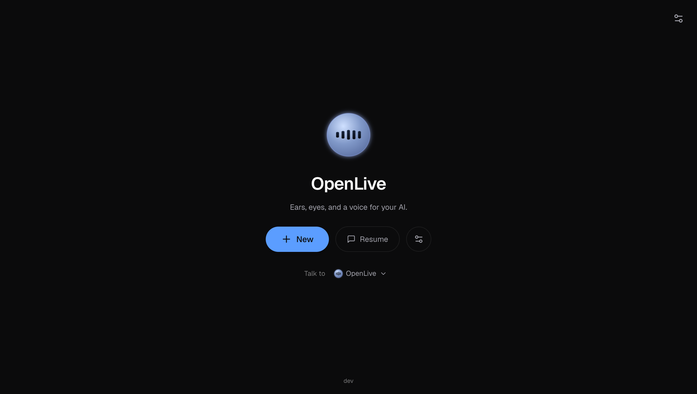
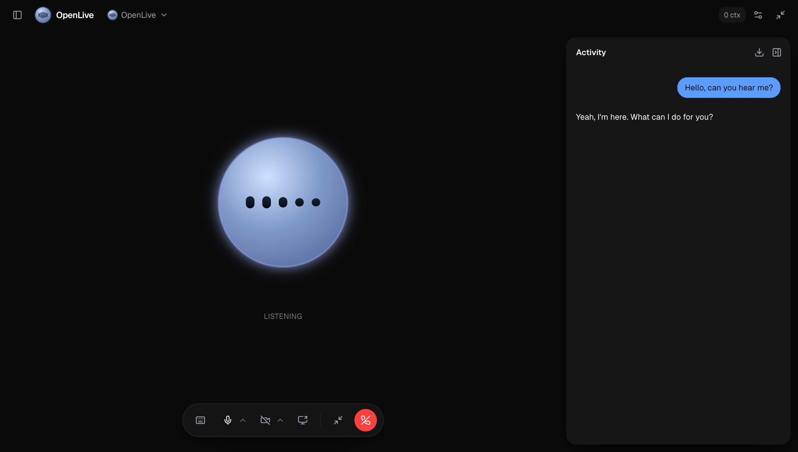
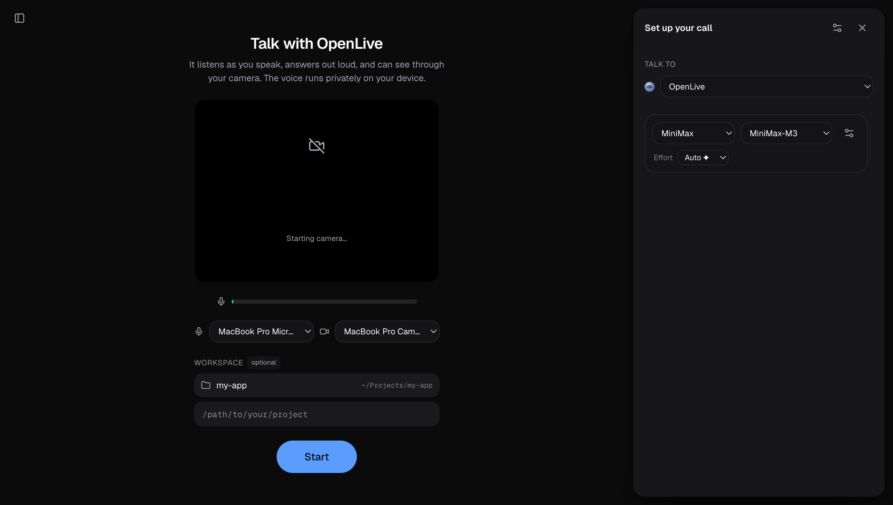
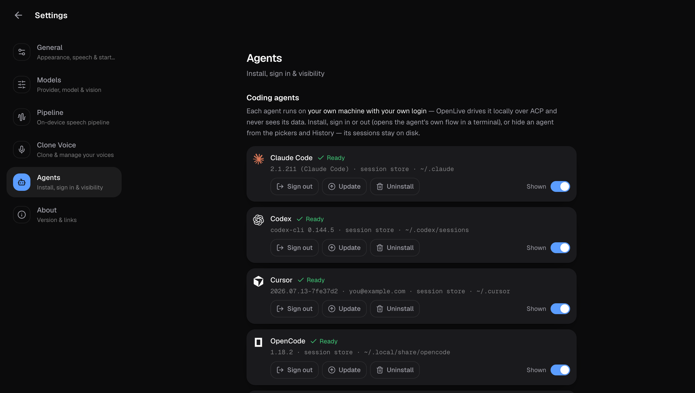

<div align="center">


# OpenLive

### Talk to your coding agents. Out loud.

A live voice + vision front-end for Claude Code, Codex, Cursor, OpenCode, and Hermes —
driven locally over the Agent Client Protocol, with the whole voice loop on-device.

[](https://github.com/katipally/openlive/releases/latest)
[](https://github.com/katipally/openlive/actions/workflows/ci.yml)
[](LICENSE)
[](CONTRIBUTING.md)

[](https://github.com/katipally/openlive/releases/latest)
&nbsp;
[](https://github.com/katipally/openlive/releases/latest)

</div>

## Demo

https://github.com/user-attachments/assets/6ebe0e47-44cb-4d4f-bc33-7f15651e6342

---

## What this is

You already have a coding agent you trust — Claude Code, Codex, Cursor, OpenCode, or
Hermes — running on your machine with your own subscription. OpenLive puts a real
conversation in front of it: you talk, it hears you, it works, and it talks back.
Show it your camera or your screen and it sees what you see.

The entire voice loop — voice activity detection, speech-to-text, end-of-turn
detection, text-to-speech, barge-in — runs **on-device** (WebGPU). The agent runs
**locally over the [Agent Client Protocol](https://agentclientprotocol.com)** (JSON-RPC
over stdio), under your own login. Nothing leaves the machine except what your agent
already sends to its own provider.

There's also a built-in assistant (bring your own model key — Anthropic, OpenAI,
Google, and a dozen more) for calls that aren't about code.

## Features

- **Voice-drive your coding agent.** Pick Claude Code / Codex / Cursor / OpenCode /
  Hermes per conversation, pick its project folder, and talk. Model, mode
  (ask / accept edits / bypass), and the agent's other options are switchable
  mid-call — all reported by the agent itself over ACP.
- **Sessions are the agent's own.** A call with Claude Code lands in
  `~/.claude/projects/…` where `claude --resume` finds it, and the agent's existing
  CLI sessions show up in OpenLive's History — resume either from either side.
- **Permission relay.** When the agent wants to run a command or edit files, OpenLive
  speaks the question; answer by voice ("yes" / "no") or tap.
- **On-device voice loop.** Silero VAD, Whisper STT, Smart-Turn end-of-turn, and
  Kokoro TTS all run in the app on WebGPU. Nothing you say leaves the machine.
- **It can see.** Camera or screen frames ride each turn for agents that accept
  images; the `look` tool grabs a crisp hi-res frame on demand.
- **Barge-in.** Interrupt any time and it stops mid-word, like a real conversation.
- **Floating mini mode.** Shrink to an always-on-top pill that keeps listening while
  you work; camera and screen previews stack right above it.
- **Manage agents in Settings.** Install / sign in / uninstall each agent's CLI from
  the app; everything streams live and keeps running if you close the panel.
- **Bring-your-own-model assistant.** The non-agent brain supports a dozen+
  providers with live model listings, vision, reasoning effort, and web-search
  tools via a delegate worker.
- **Private by design.** Audio never uploads. API keys are encrypted at rest
  (AES-256-GCM) and only the last four digits are ever shown.

## Screenshots

| Home | In a live call |
|---|---|
|  |  |
| **Pre-call setup** | **Settings — bring your own model** |
|  |  |

## How it works

```
mic ─▶ VAD ─▶ streaming STT ─▶ end-of-turn ─▶ your coding agent ─▶ streaming TTS ─▶ speaker
     (Silero)  (Whisper)        (Smart-Turn)   (ACP, local stdio)    (Kokoro)
                                                    ▲
                             camera / screen frames ┘   (vision)
```

Everything left of the agent runs locally in the renderer. The turn goes over a warm
local WebSocket to a small agent server, which drives your coding agent's ACP adapter
as a child process and streams the reply back — the app starts speaking sentence by
sentence while the agent is still working. Conversations with no agent bound run on
the built-in provider brain instead.

## Get started

**Just use it:** grab the installer from the
[latest release](https://github.com/katipally/openlive/releases/latest), open the app,
pick the agent you already use (install/sign in from Settings → Agents if needed),
choose a project folder, and start a call. The voice models download the first time
you talk (about 200 MB, cached after that).

**Build it from source:**

```bash
pnpm install
pnpm desktop:dev      # runs the web + agent servers and opens the app window
```

You can also run it in a browser during development with `pnpm dev`, then open
`localhost:3000`. Run the tests with `pnpm test`.

## Repo layout

```
apps/desktop     Electron shell: spawns the local servers, media perms, window, mini mode
apps/web         Next.js UI + the on-device voice engine (src/lib/live/*) + /api routes
                 (agents install/auth, history discovery, settings)
services/agent   Hono + ws: the /live WebSocket, the ACP agent driver (acp-agent.ts,
                 supervisor.ts) and the built-in provider turn loop
packages/shared  the agent registry (single source of agent identity), wire protocol,
                 shared types
packages/harness provider-neutral model adapters, live model listing, cost/effort
packages/db      JSON-file store: encrypted keys, settings, conversations
```

For how the pieces fit together — the ACP driver, the voice loop, resume, and the
delegate/worker tool flow — see [docs/ARCHITECTURE.md](docs/ARCHITECTURE.md).

## Contributing

OpenLive is open to contributions. Start with [CONTRIBUTING.md](CONTRIBUTING.md) for
how to set up, where things live, and how to send a change. Good first issues are
labeled in the tracker.

## License

[MIT](LICENSE). Use it, change it, ship it.
