<div align="center">


# OpenLive

### The open voice and vision layer for AI agents.

Your AI can think. OpenLive gives it ears, a mouth, and eyes.
Bring your own model, or talk to the coding agents you already use, with the whole
voice loop running on your own machine. An open alternative to ElevenLabs Agents,
Gemini Live, and OpenAI Realtime.

[](https://github.com/katipally/openlive/releases/latest)
[](https://github.com/katipally/openlive/actions/workflows/ci.yml)
[](LICENSE)
[](CONTRIBUTING.md)

[](https://github.com/katipally/openlive/releases/latest)
&nbsp;
[](https://github.com/katipally/openlive/releases/latest)
&nbsp;
[](https://github.com/katipally/openlive/releases/latest)

</div>

## Demo

https://github.com/user-attachments/assets/065775b0-0a4a-4adf-8fa7-bcf065e6337f

---

## What this is

Wiring an AI into a real conversation is harder than it looks: voice activity
detection, knowing when someone actually stopped talking, streaming speech-to-text,
the model turn, streaming text-to-speech, and barge-in so you can interrupt. Then
camera and screen on top. Hosted platforms rent you that pipeline by the minute and
run it on their cloud.

OpenLive is that pipeline, open and local. The listening, the speaking, and the
watching all run on-device (WebGPU). You bring the brain, and any brain works:

- **A model you have a key for.** Anthropic, OpenAI, Google, xAI, DeepSeek, Groq,
  Ollama (fully local), and a dozen more. No per-minute audio fees; you pay only
  the model costs you'd pay anyway.
- **The coding agent you already use.** Claude Code, Codex, Cursor, OpenCode, or
  Hermes, driven locally over the
  [Agent Client Protocol](https://agentclientprotocol.com) (JSON-RPC over stdio),
  under your own login. Talk to your agent, watch it work, answer its permission
  asks by voice.

Whichever brain you pick, OpenLive is the same thing it has always been: the ears,
mouth, and eyes around it. Nothing you say leaves the machine. The only thing that
goes out is the final transcript (plus camera or screen frames if you turn them on),
to whatever brain you picked.

The same ears, mouth, and eyes also work outside a call. **Flow** is OpenLive's
voice assistant for the whole machine: tap `Control` twice in any app, say what you
want, and it answers out loud, types where your cursor is, or drives your apps for
you. More in [Flow](#flow) below.

An honest note on architecture: OpenLive is a cascaded pipeline (speech to text to
model to speech), not a full-duplex speech-to-speech model like GPT-Live. That's a
real trade. A speech-native model can overlap talk and listen in ways a cascade
can't, but the cascade is exactly what makes "any brain, all local, no audio fees"
possible.

## Features

The core, the ears / mouth / eyes:

- **On-device voice loop.** Silero VAD, speech to text, Smart-Turn end-of-turn,
  and text to speech, all on this machine. Speech to text is Whisper on WebGPU, or
  a native engine: Nemotron (transcribes while you talk), Parakeet, Moonshine or
  Canary. Text to speech is Kokoro (28 voices, light), Supertonic (10 voices,
  44.1 kHz), or a native Pocket TTS, Kitten TTS, Piper, Kokoro (CPU) or Matcha that
  starts speaking before the sentence is done. Each native engine comes in variants
  (size, precision, latency, voice), picked from its Model menu in Settings → Voice
  and downloaded on demand; they run in the local agent service on CPU and fall
  back to Whisper or the browser voice for the language when missing.
- **Ten languages.** English, Spanish, French, German, Italian, Portuguese, Hindi,
  Chinese, Japanese or Korean, picked once in Settings → Voice. Every stage and the
  reply follow it. Engines that don't speak it are greyed out, and switching
  swaps in one that does and tells you what changed.
- **Speak as yourself.** Settings → Voice records 5 to 30 seconds of you
  (with a seekable listen-back before anything is saved) and your assistant speaks
  in your voice from then on. Zero-shot cloning (ZipVoice, Apache-2.0) running
  locally, an optional ~208 MB install, deletable anytime. Profiles preview with any
  text, rename, and export/import between machines. Clone only your own voice or
  one you have clear permission to use; impersonation is on you, not the tool.
- **It can see.** Camera or screen frames ride each turn, and the `look` tool grabs
  a crisp hi-res frame on demand. A text-only model can borrow a separate vision
  model's eyes.
- **Barge-in.** Interrupt any time and it stops mid-word, like a real conversation.
- **Your assistant, your way.** Custom instructions in Settings → General apply to
  every brain, built-in or agent. Speaking speed and spoken progress narration live
  there too.

The integrations that serve it:

- **Voice-drive your coding agent.** Pick Claude Code / Codex / Cursor / OpenCode /
  Hermes per conversation, pick its project folder, and talk. Model, mode
  (ask / accept edits / bypass), and the agent's other options switch mid-call, all
  reported by the agent itself over ACP.
- **Sessions are the agent's own.** A call with Claude Code lands in
  `~/.claude/projects/…` where `claude --resume` finds it, and the agent's existing
  CLI sessions show up in OpenLive's History. Resume from either side.
- **Permission relay.** When the agent wants to run a command or edit files,
  OpenLive speaks the question; answer by voice ("yes" / "no") or tap.
- **Narrated progress.** Optional: while the agent works in silence, OpenLive speaks
  its plan steps out loud ("Step 2 of 4 — refactor the store").
- **Live plans and costs.** The agent's working plan renders as a checklist while it
  works, and a context/cost chip tracks the session.
- **Manage agents in Settings.** Install, sign in, update, and uninstall each
  agent's CLI from the app. Status updates itself while you finish a sign-in in the
  terminal, and if the terminal can't open you get the exact command to run instead.
- **A call that stays in reach.** Minimise OpenLive mid-call and the call rides on
  the orb above the dock (mute, open, end), with a menu-bar tray and notifications
  to close the loop.
- **A transcript you can use.** Agent replies render as markdown with copy buttons
  on code blocks, and the whole conversation exports to a Markdown file.
- **Private by design.** Audio never uploads. API keys are encrypted at rest
  (AES-256-GCM) and only the last four digits are ever shown.

Flow, the assistant for the whole machine:

- **Summoned anywhere.** Double tap `Control` in any app, or pick New Flow session
  from the tray. A small orb rises over the dock and listens; the same gesture
  closes it.
- **Acts on your machine.** Types at your cursor, opens apps and links, clicks,
  scrolls, reads the screen (screenshots and OCR), manages windows, and runs shell
  commands, checking the screen after every step.
- **Any brain.** API mode on the provider set in Settings, from MiniMax, OpenAI or
  Anthropic to a local Ollama, or a coding agent over ACP with the same tools.
- **You stay in control.** One consent question before it first acts, a caption
  with Stop the whole time it acts, and a failure card with the fix when
  something goes wrong.

## Flow

Flow is the voice assistant that lives over your dock, not in a window.

```
 any app ──▶ tap Control, Control ──▶ orb listens ──▶ thinks ──▶ acts / speaks
                                          ▲                          │
                                          └──── next sentence ◀──────┘
```

- **Summon it.** Double tap `Control` (`Ctrl` on Windows and Linux) anywhere, or
  tray > **New Flow session**. Hover the orb for close and open-OpenLive buttons.
- **What it can do.** Answer out loud, type into the app you are in, and drive the
  machine: open apps and links, click, type, scroll, take screenshots, read text on
  screen, move and close windows, run shell commands.
- **Brains.** API mode uses the provider, model, and vision model from Settings >
  Models (MiniMax, OpenAI, Anthropic, Ollama at any address, and the rest). Or pick
  a coding agent such as Claude Code, driven over ACP with the same tools. A model
  that cannot see gets the vision model's description of each screenshot.
- **Orb states.** Listening (teal), thinking (violet), acting (magenta, with a
  caption strip), speaking (blue), error (dark red, with a card).
- **Safety.** Flow asks once before it first acts on the machine and remembers the
  yes (take it back in Settings > Flow). While it acts, the caption names what it
  is doing next to a **Stop** button. Every failure shows a card with its fix.
- **What leaves the machine.** Your voice never does. The transcript, the front
  app, window title and selection, and tool results, including screenshots, go to
  the brain you chose. An Ollama address off this computer asks for confirmation
  first, since it will receive screen content.
- **Setup.** On macOS, grant Microphone, Accessibility and Screen Recording in
  Settings > Flow > Access. Windows and Linux have their own backends; Wayland
  cannot deliver the global key, so use the tray there.

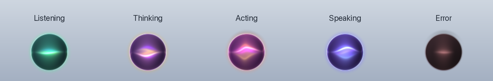

The full guide, with every setting, failure card, platform detail, and the
architecture, is in [docs/FLOW.md](docs/FLOW.md).

## Screenshots

| Home | In a live call |
|---|---|
| 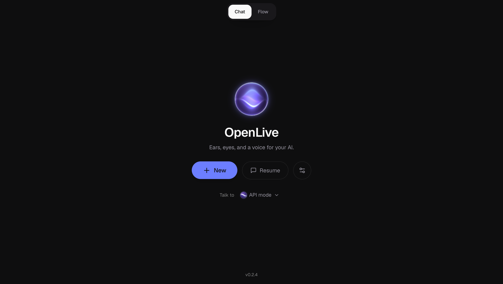 | 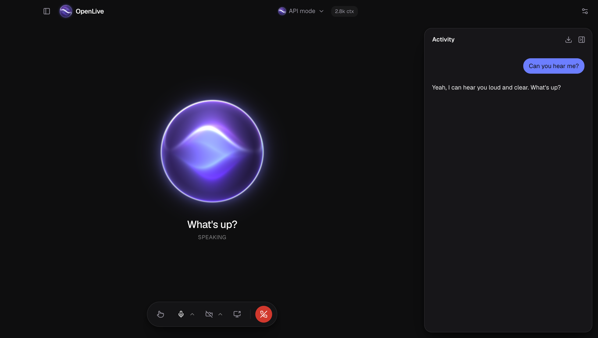 |
| **Pre-call setup** | **Settings — agents** |
| 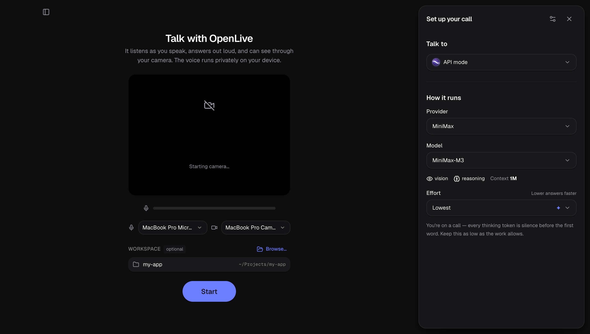 | 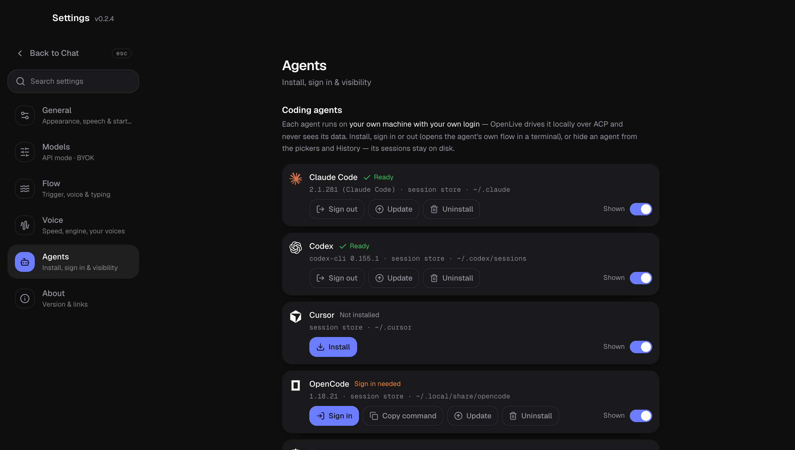 |
| **Clone your voice** | **Flow home** |
| 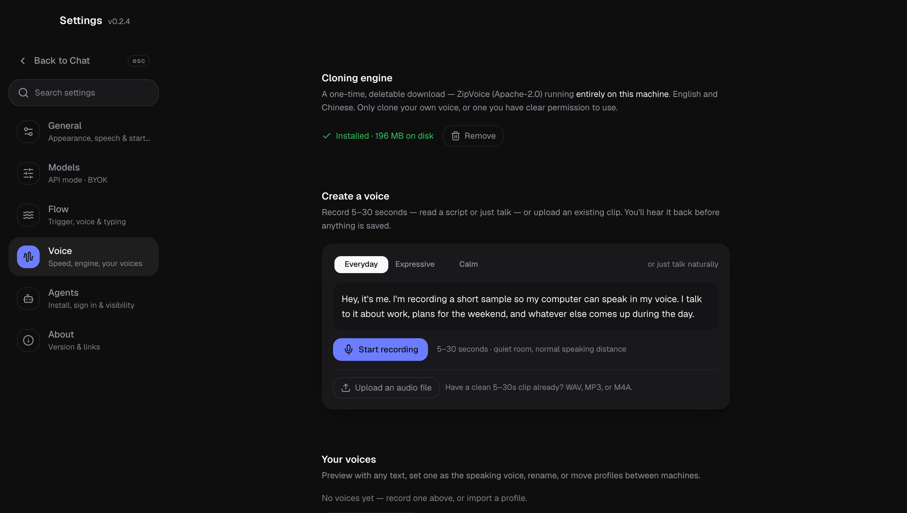 | 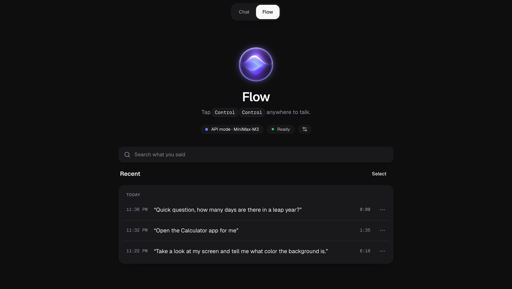 |
| **Flow acting, with Stop** | **Flow asks once before it acts** |
| 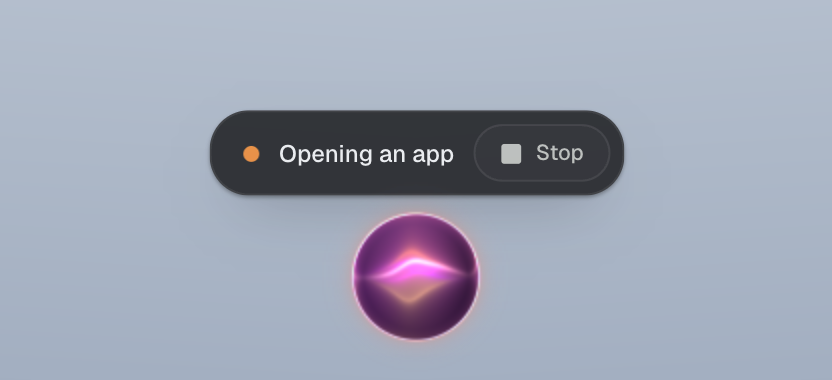 | 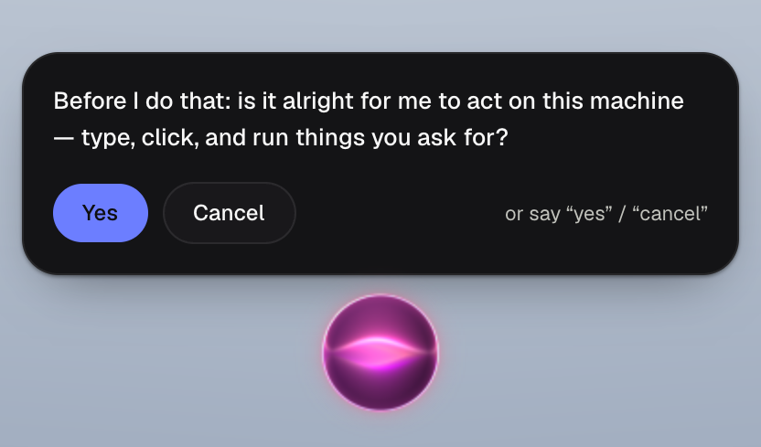 |
| **Flow speaking** | **Hover controls beside the orb** |
|  |  |
| **A failure card with its fix** | **Settings, Flow** |
| 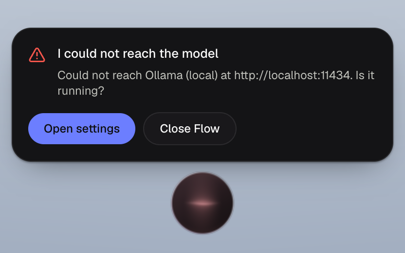 | 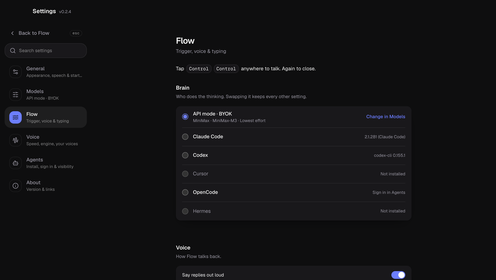 |

## Why on-device voice matters

The listening and speaking never leave your computer. The only thing that goes out
is the text turn to the brain you picked, the same call you would make from any app.
No audio uploads, no per-minute meter, no lock-in.

That also skips the separate speech-to-text, text-to-speech, and real-time-audio
fees hosted platforms charge on top. You still pay your normal model and vision API
costs, nothing more. With a coding agent as the brain there's nothing extra to pay
at all; it runs under the login you already have.

## How it works

```
mic ─▶ VAD ─▶ streaming STT ─▶ end-of-turn ─▶ your AI ──────────▶ streaming TTS ─▶ speaker
     (Silero)  (Whisper or      (Smart-Turn)  (BYO model, or a     (Kokoro / Supertonic /
               native engines)      ▲          coding agent over    Pocket / Kitten /
                camera / screen ────┘          ACP on local stdio)  your cloned voice)
                frames (vision)
```

Everything outside "your AI" runs locally in the renderer. The turn goes over a warm
local WebSocket to a small agent server, which either streams a provider reply or
drives your coding agent's ACP adapter as a child process. The app starts speaking
sentence by sentence while the reply is still being written.

Flow runs the same voice loop in a hidden window, with a second local socket and
a tool loop on the agent server:

```
Control, Control ─▶ orb ─▶ voice loop ─▶ Flow socket ─▶ brain ─▶ tools ─▶ your apps
                   (over                (flow-ws)     (API      (type, click,
                    the dock)                          or ACP)   screenshot, OCR…)
```

## Get started

**Just use it:** grab the installer from the
[latest release](https://github.com/katipally/openlive/releases/latest), open the app,
paste a model key (or pick the coding agent you already use — install/sign in from
Settings → Agents if needed), and start a call. The voice models download from
Hugging Face the first time you talk — roughly 200 MB with Kokoro, more with
Supertonic or a bigger Whisper — and are cached after that.

**Build it from source:**

```bash
pnpm install
pnpm desktop:dev      # runs the web + agent servers and opens the app window
```

You can also run it in a browser during development with `pnpm dev`, then open
`localhost:3000`. Run the tests with `pnpm test`.

## Repo layout

```
apps/desktop     Electron shell: spawns the local servers, media perms, window,
                 Flow's orb, tray + notifications
apps/web         Next.js UI + the on-device voice engine (src/lib/live/*) + /api routes
                 (agents install/auth, history discovery, settings)
services/agent   Hono + ws: the /live WebSocket, the ACP agent driver (acp-agent.ts,
                 supervisor.ts), voice cloning (voice/*), the built-in provider turn loop
packages/shared  the agent registry (single source of agent identity), wire protocol,
                 shared types
packages/harness provider-neutral model adapters, live model listing, cost/effort
packages/db      JSON-file store: encrypted keys, settings, conversations
packages/flow-store Flow's config and session history in ~/.openlive/flow
native/ol-input  Rust addon for Flow: the global key, typing, capture, OCR, input
```

Flow's pieces: `apps/web/src/components/flow` and `src/lib/flow` (the orb and its
owner renderer), `services/agent/src/flow` and `src/live/flow-ws.ts` (the tool loop,
brains, and tools), and `apps/desktop/flow-*.cjs` (the addon bridge).

For how the pieces fit together — the ACP driver, the voice loop, resume, and the
delegate/worker tool flow — see [docs/ARCHITECTURE.md](docs/ARCHITECTURE.md).
For Flow, see [docs/FLOW.md](docs/FLOW.md).

## Contributing

OpenLive is open to contributions. Start with [CONTRIBUTING.md](CONTRIBUTING.md) for
how to set up, where things live, and how to send a change. Good first issues are
labeled in the tracker.

## License

[MIT](LICENSE). Use it, change it, ship it.
