<div align="center">

<picture>
  <source media="(prefers-color-scheme: dark)" srcset="assets/logo-dark.gif" />
  
</picture>

# OpenLive

### The open voice and vision layer for AI agents.

Your AI can think. OpenLive gives it ears, a mouth, and eyes.
Bring your own model, or talk to the coding agents you already use, with the whole
voice loop running on your own machine. An open alternative to ElevenLabs Agents,
Gemini Live, and OpenAI Realtime.

[](https://github.com/katipally/openlive/releases/latest)
[](https://github.com/katipally/openlive/actions/workflows/ci.yml)
[](LICENSE)
[](CONTRIBUTING.md)

[](https://github.com/katipally/openlive/releases/latest)
&nbsp;
[](https://github.com/katipally/openlive/releases/latest)
&nbsp;
[](https://github.com/katipally/openlive/releases/latest)

</div>

## Demo

https://github.com/user-attachments/assets/065775b0-0a4a-4adf-8fa7-bcf065e6337f

---

## What this is

Wiring an AI into a real conversation is harder than it looks: voice activity
detection, knowing when someone actually stopped talking, streaming speech-to-text,
the model turn, streaming text-to-speech, and barge-in so you can interrupt. Then
camera and screen on top. Hosted platforms rent you that pipeline by the minute and
run it on their cloud.

OpenLive is that pipeline, open and local. The listening, the speaking, and the
watching all run on-device (WebGPU in the app, or native engines on your CPU or GPU). You pick who answers, and anyone works:

- **A model you have a key for.** Anthropic, OpenAI, Google Gemini, xAI, DeepSeek,
  Groq, Ollama (fully local), MiniMax, OpenRouter, Mistral, Together, Fireworks,
  Cerebras, Perplexity and Ollama Cloud. No per-minute audio fees; you pay only
  the model costs you'd pay anyway.
- **The coding agent you already use.** Claude Code, Codex, Cursor, OpenCode,
  Hermes, Gemini CLI, GitHub Copilot, Kiro, or Pi, driven locally over the
  [Agent Client Protocol](https://agentclientprotocol.com) (JSON-RPC over stdio),
  under your own login. Talk to your agent, watch it work, answer its permission
  asks by voice.

Whoever answers, OpenLive is the same thing it has always been: the ears,
mouth, and eyes around it. Nothing you say leaves the machine. The only thing that
goes out is the final transcript (plus camera or screen frames if you turn them on),
to whoever answers. Anonymous usage counts are separate, and off in one
switch: see [Privacy](#privacy).

The same ears, mouth, and eyes also work outside a call. **Flow** is OpenLive's
voice assistant for the whole machine: tap `Control` twice in any app, say what you
want, and it answers out loud, types where your cursor is, or drives your apps for
you. **Dictate** types what you say into any text box. More in [Flow](#flow) and
[Dictate](#dictate) below.

An honest note on architecture: OpenLive is a cascaded pipeline (speech to text to
model to speech), not a full-duplex speech-to-speech model like GPT-Live. That's a
real trade. A speech-native model can overlap talk and listen in ways a cascade
can't, but the cascade is exactly what makes "any model or agent, all local, no audio fees"
possible.

## Features

Three modes, one voice. Pick **Chat**, **Flow** or **Dictate** at the top of
the window; each has its own home, its own History and its own tab in Settings,
in the same shape.

```
 Chat     a call in the window       talk, it answers out loud, sees if you let it
 Flow     any app, over your dock    ask, it answers out loud and acts for you
 Dictate  any text box               talk, your words are typed at the cursor
```

What every mode is built on, the ears, mouth and eyes:

- **On-device voice loop.** Silero VAD, speech to text, Smart-Turn end-of-turn,
  and text to speech, all on this machine. Speech to text is Whisper on WebGPU, or
  a native engine: Nemotron (transcribes while you talk), Parakeet, Moonshine or
  Canary. Text to speech is Kokoro (28 voices, light), Supertonic (10 voices,
  44.1 kHz), or a native Pocket TTS, Kitten TTS, Piper, Kokoro (CPU) or Matcha that
  starts speaking before the sentence is done. Each native engine comes in variants
  (size, precision, latency, voice), picked from its Model menu in Settings > Speech engine
  and downloaded on demand; they run in the local agent service, on the CPU or an
  accelerator it measures faster on your machine, and fall back to Whisper or the
  browser voice for the language when missing. On the desktop, Supertonic can run
  there too, on your GPU, with the browser's Supertonic as its fallback.
- **Ten languages.** English, Spanish, French, German, Italian, Portuguese, Hindi,
  Chinese, Japanese or Korean, picked once in Settings > Voice. Every stage and the
  reply follow it. Engines that don't speak it are greyed out, and switching
  swaps in one that does and tells you what changed.
- **Speak as yourself.** Settings > Voice records 5 to 30 seconds of you
  (with a seekable listen-back before anything is saved) and your assistant speaks
  in your voice from then on. Zero-shot cloning (ZipVoice) running
  locally, an optional ~208 MB install, deletable anytime. Its weights carry no
  license and were trained on non-commercial data, so it stays locked until you
  allow models with a restricted license. Profiles preview with any
  text, rename, and export/import between machines. Clone only your own voice or
  one you have clear permission to use; impersonation is on you, not the tool.
- **It can see.** Camera or screen frames ride each turn, and the `look` tool grabs
  a crisp hi-res frame on demand. A text-only model can borrow a separate vision
  model's eyes.
- **Barge-in.** Interrupt any time and it stops mid-word, like a real conversation.
- **Your assistant, your way.** **Assistant style** in Settings > General, your own
  instructions, applies to whoever answers, your API key's model or a coding agent. Speaking speed and spoken progress narration live
  in Settings > Voice.
- **Tools, skills and connectors.** Settings > Capabilities turns built-in tools
  on or off, holds your skills, and adds MCP connectors, or imports them from
  Claude Desktop, Claude Code, Codex, Cursor, Gemini CLI and VS Code. Your API
  key's model and coding agents get the same set.
- **It remembers you.** Settings > Memory lists the facts carried into every
  conversation, whoever answers. Edit or forget any of them.

### Chat

A voice call with your AI, in the OpenLive window. The full guide is
[docs/CHAT.md](docs/CHAT.md).

- **Set up, then talk.** **New** opens the call setup: pick a project folder,
  check your mic and camera, choose who answers, and press **Start**. The
  first Start asks before the voice models download, with their size.
- **Voice-drive your coding agent.** Pick Claude Code / Codex / Cursor / OpenCode /
  Hermes / Gemini CLI / GitHub Copilot / Kiro / Pi per conversation (new chats start
  with the default from Settings > Models > Who answers you), pick its project folder, and talk. Model, mode
  (ask / accept edits / bypass), and the agent's other options switch mid-call, all
  reported by the agent itself over ACP.
- **Sessions are the agent's own.** A call with Claude Code lands in
  `~/.claude/projects/…` where `claude --resume` finds it, and the agent's existing
  CLI sessions show up in OpenLive's History. Resume from either side.
- **Permission relay.** When the agent wants to run a command or edit files,
  OpenLive speaks the question; answer by voice ("yes" / "no") or tap.
- **Narrated progress.** Optional, in calls and in Flow alike (Settings > Voice):
  while the agent works in silence, OpenLive speaks its plan steps out loud
  ("Step 2 of 4: refactor the store").
- **Live plans and costs.** The agent's working plan renders as a checklist while it
  works, and a context/cost chip tracks the session.
- **Manage agents in Settings.** Install, sign in, update, and uninstall each
  agent's CLI from the app. Status updates itself while you finish a sign-in in the
  terminal, and if the terminal can't open you get the exact command to run instead.
- **A call that stays in reach.** Minimise OpenLive mid-call and the call rides on
  the orb above the dock (mute, open, end), with a menu-bar tray and notifications
  to close the loop.
- **A transcript you can use.** Agent replies render as markdown with copy buttons
  on code blocks, and the whole conversation exports to a Markdown file.
- **Private by design.** Audio never uploads. API keys are encrypted at rest
  (AES-256-GCM) and only the last four digits are ever shown.

### Flow


Ask your computer, from any app. Flow is the voice assistant that lives over
your dock, not in a window: your AI listens, answers out loud, and can act for
you.

```
 any app ──▶ tap Control, Control ──▶ orb listens ──▶ thinks ──▶ acts / speaks
                                          ▲                          │
                                          └──── next sentence ◀──────┘
```

- **Summon it.** Double tap `Control` (`Ctrl` on Windows and Linux) anywhere, or
  tray > **Start Flow**. The same double tap, or **Close after silence**,
  closes it; Esc never does. Hover the orb for close, open-OpenLive and start-dictation buttons.
  The switch on Flow's home, or in the tray, turns it off and on, and a restart
  keeps it as you left it.
- **What it can do.** Answer out loud, type into the app you are in, and drive the
  machine: open apps and links, click, type, scroll, take screenshots, read text on
  screen, move and close windows, run shell commands. On macOS it operates app
  windows through **OpenLive Computer Use**, a helper with its own grants that
  presses controls by name rather than aiming at pixels.
- **Who answers.** The default from Settings > Models > **Who answers you**, the
  same one new chats start with, or Flow's own from Settings > Flow. **Your API
  key** uses the provider, model, and vision model from Settings > Models
  (MiniMax, OpenAI, Anthropic, Ollama at any address, and the rest). **A coding
  agent** such as Claude Code is driven over ACP with the same tools. A model
  that cannot see gets the vision model's description of each screenshot.
- **Orb states.** Listening (teal), thinking (violet), acting (magenta, with a
  caption strip), speaking (blue), error (dark red, with a card).
- **Safety.** Flow asks once before it first acts on the machine and remembers the
  yes (take it back in Settings > Flow). While it acts, the caption names what it
  is doing next to a **Stop** button. Every failure shows a card with its fix.
- **What leaves the machine.** Your voice never does. The transcript, the front
  app, window title and selection, and tool results, including screenshots, go to
  whoever answers. An Ollama address off this computer asks for confirmation
  first, since it will receive screen content. Anonymous usage counts are separate:
  see [Privacy](#privacy).
- **Setup.** On macOS, grant Microphone, Accessibility and Screen Recording in
  Settings > Flow > Access. Windows and Linux have their own backends; on
  Linux the keys need the `input` group (X11 and Wayland alike), and until
  then the tray opens Flow, and in Push to talk a call's **Hold to talk** button works.

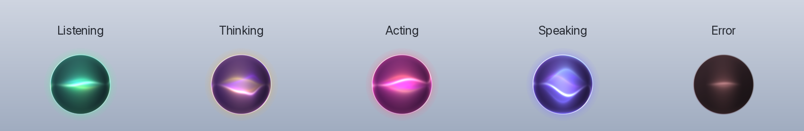

The full guide, with every setting, failure card, platform detail, and the
architecture, is in [docs/FLOW.md](docs/FLOW.md).

### Dictate

Voice typing into any text box: double-tap Option (Alt on Windows and Linux),
talk the way you set in **How you talk**, and your words are typed at the
cursor. The full guide is [docs/DICTATE.md](docs/DICTATE.md).

- **On this machine.** No AI and nothing spoken back. Rules on this machine
  tidy what you said: punctuation, filler words, backtrack, lists, numbers.
- **AI polish, if you want it.** Off by default. Rewrites what you said in a
  tone you pick, with your API key or a coding agent.
- **Edit by voice.** Select text, then say how to change it ("make this
  formal").
- **Your words.** A dictionary for names and terms, snippets that expand, and
  spoken commands like "new line" and "undo that".
- **Undo on the orb** for a few seconds after Dictate types, and your clipboard
  put back after each paste (Settings > General > Typing at cursor).
- **On and off on its home**, or from the tray. Off until you turn it on.

### How you talk

One setting for Chat, Flow and Dictate, in Settings > General, the tray and
the command palette, also asked once in Welcome:

```
 Hands-free    just talk; a pause ends what you said            (the default)
 Push to talk  hold Fn on a Mac (Right Ctrl on Windows and Linux) while you talk;
               the microphone is on only while the key is down
```

Every key is yours to change in Settings > General. In a call, the **Hold to
talk** button works too, with no key at all.

### History

Each mode keeps its own, on this machine, under one name: **History**.

| | Where | Search | Delete one | Keep for | Default |
|---|---|---|---|---|---|
| Chat | The drawer from Chat's home, `H` in a call | Titles and folders | Undo toast | Settings > Chat | Forever |
| Flow | Flow's home | What you said | Undo toast | Settings > Flow | Forever |
| Dictate | Dictate's home | What you dictated | Undo toast | Settings > Dictate | 30 days |

Each History section in Settings offers Keep nothing, 1 day, 7 days, 30 days or
forever, and **Clear all**, which asks first. Flow's sessions take their
screenshots with them. A conversation or session still open is never deleted,
and Chat's only ever touches conversations started in OpenLive: the agents' own
CLI sessions are left alone.

### Command palette and tray

`⌘K` (`Ctrl+K` on Windows and Linux) opens the command palette. The tray (menu
bar on macOS) has the same verbs, so Flow and Dictate work with no window open.

```
 Palette                              Tray
 New call                             Flow is ready  ·  Double-tap ⌃
 Start Flow                           Dictate is on  ·  Double-tap ⌥
 Turn Flow on / off                   Open OpenLive
 Turn Dictate on / off                New call
 How you talk: Push to talk           Start Flow
 Open Chat / Flow / Dictate history   Turn Flow off
 Show me around again                 Turn Dictate off
 Show shortcuts                       How you talk ▸ Hands-free / Push to talk
 Toggle theme                         Allow Accessibility… (only when needed)
 Report a problem                     Settings…
 every Settings tab                   Quit OpenLive
```

### Ready at a glance

Each home says whether its mode would work right now: **Ready**, or the one
thing missing as a button that goes to the fix.

- **Chat**: install or sign in to the agent, add an API key, download the
  voice models (with the size, read without downloading anything), or allow
  the microphone.
- **Flow**: allow the microphone or Accessibility (input access on Windows and
  Linux), or the key listener stopped.
- **Dictate**: the same grants as Flow, while it's on.

### Getting started

```
 first launch ──▶ Welcome ──▶ a mode's first run ──▶ that screen's tour
                  (once)      Flow: setup             at most 4 steps, once
                              Dictate: 2 cards
```

- **Welcome**: the three modes, who answers you, what the computer has to
  allow, How you talk, and one thing to try in each mode.
- **First runs**: Flow's setup asks for what Flow needs; Dictate's two cards
  explain it and give you a box to try it in.
- **Tours**: each screen points at a few things the first time it shows,
  skipping anything a first run just covered.
- **Skip** always asks first, since it's for good. Settings > About > **Show
  me around again** (or the palette) plays all of it again, after a confirm.

## Screenshots

| Chat home | In a live call |
|---|---|
| 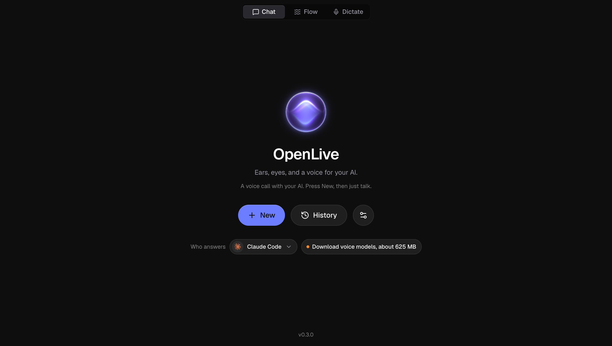 | 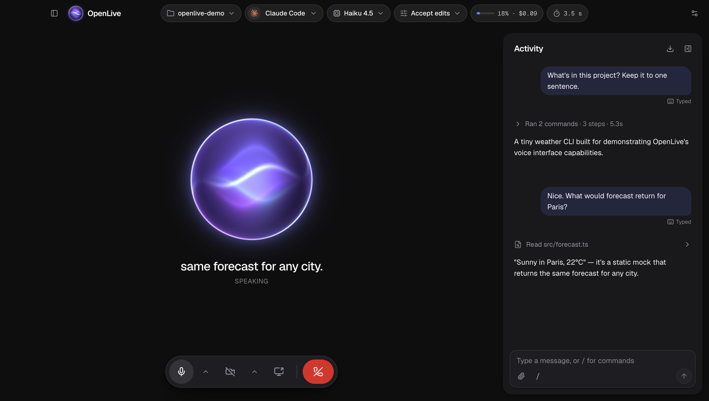 |
| **Pre-call setup** | **Settings, General** |
| 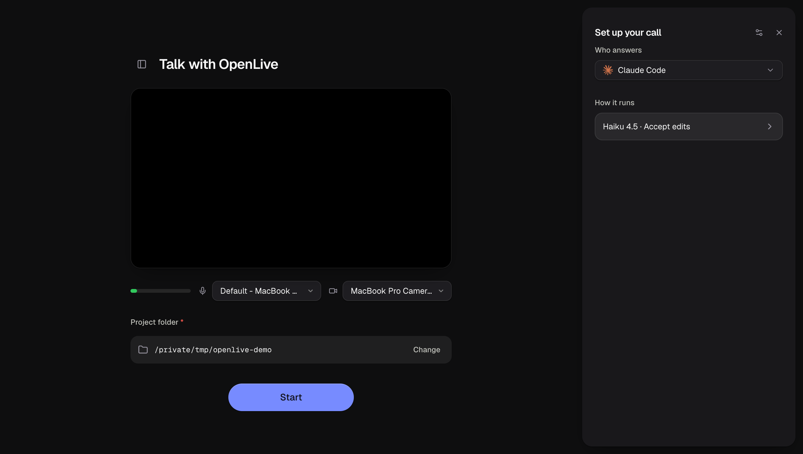 | 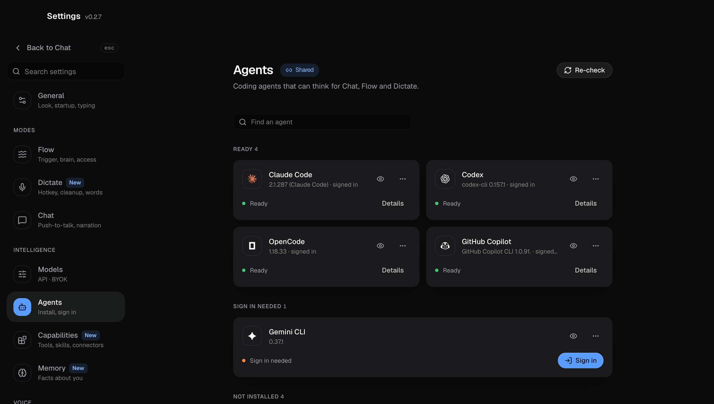 |
| **Clone your voice** | **Flow home** |
| 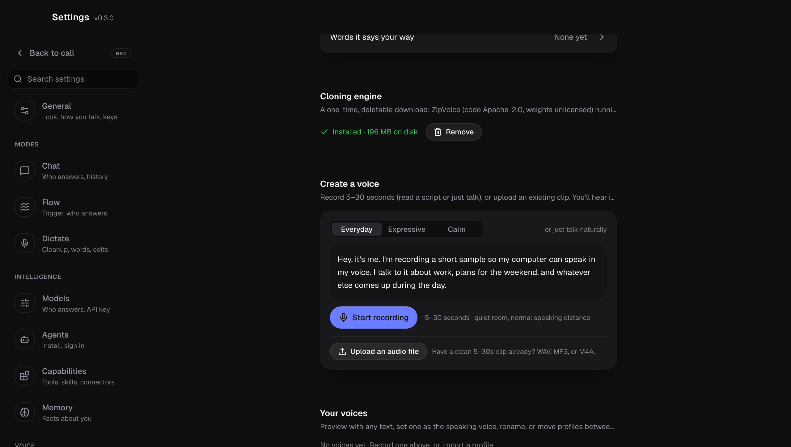 | 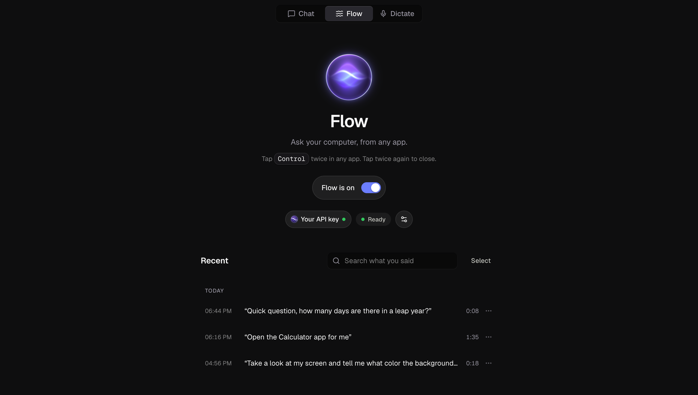 |
| **Flow acting, with Stop** | **Flow asks once before it acts** |
| 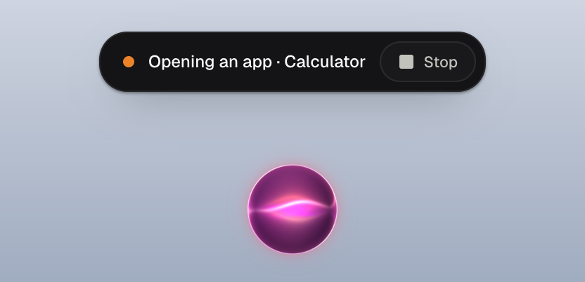 | 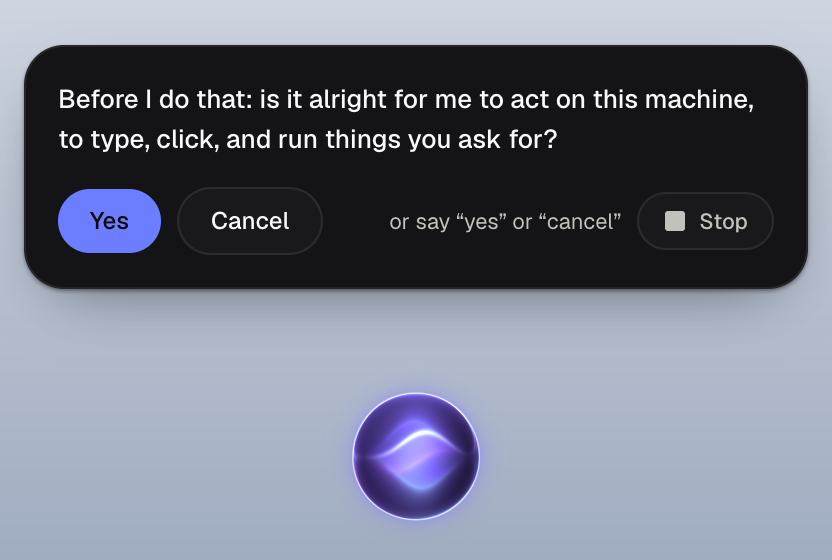 |
| **Flow speaking** | **Hover controls beside the orb** |
|  |  |
| **A failure card with its fix** | **Settings, Flow** |
| 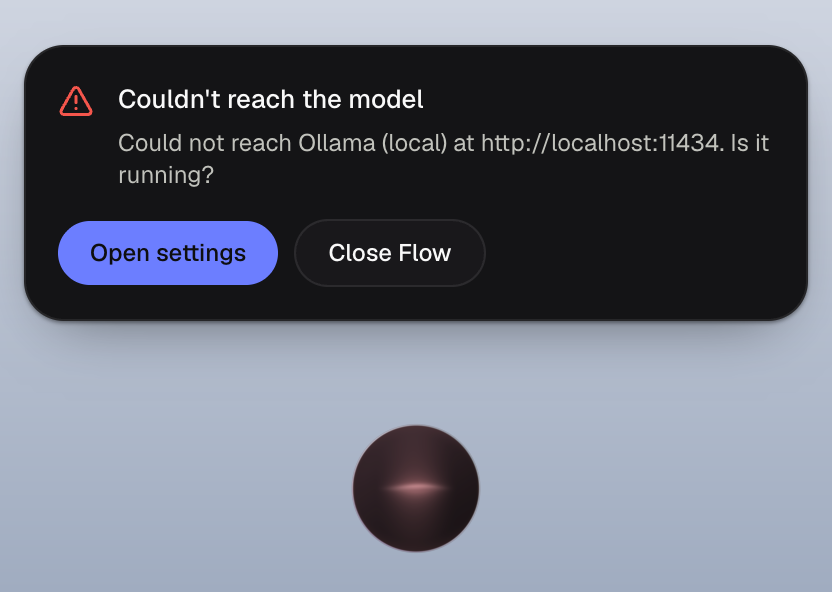 | 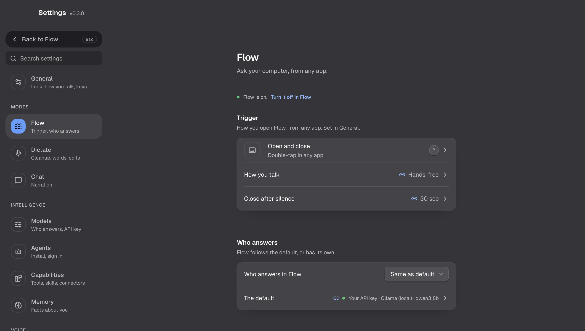 |
| **Dictate, words and snippets** | **Dictate home** |
| 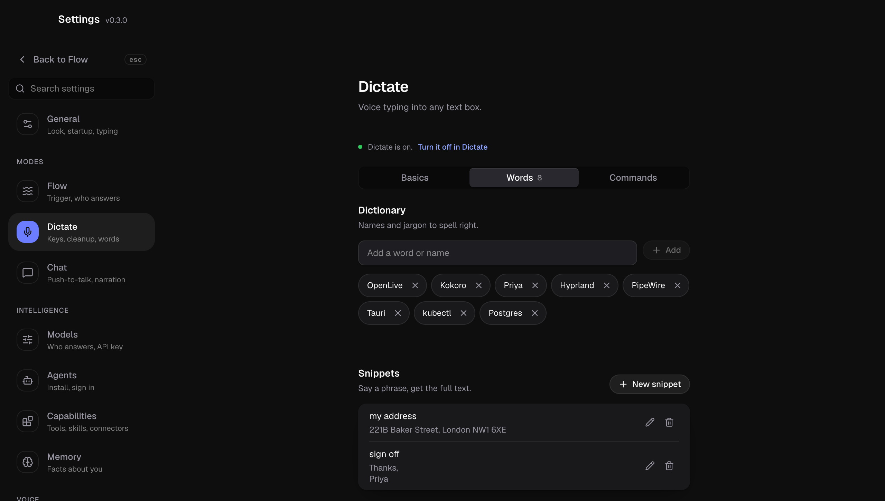 | 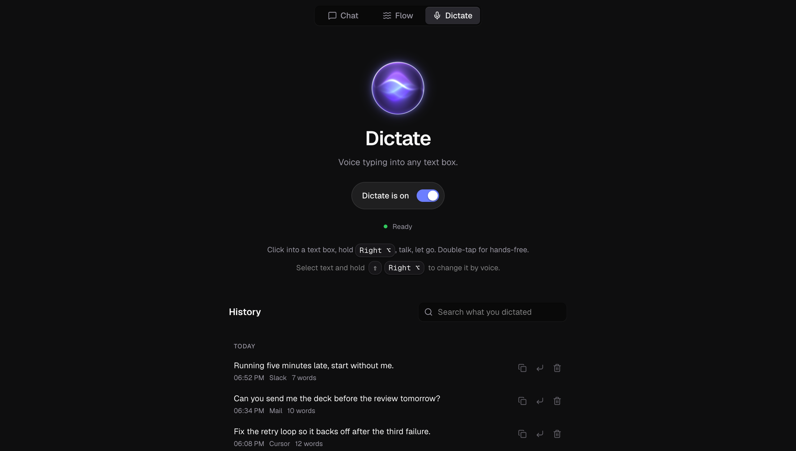 |
| **First-run welcome** | **A tour, the first time a screen shows** |
| 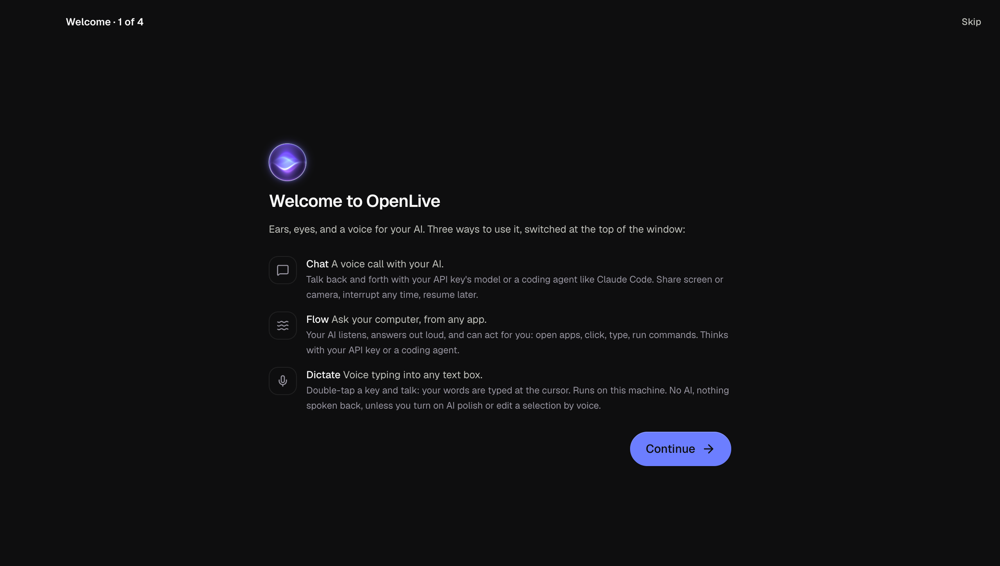 | 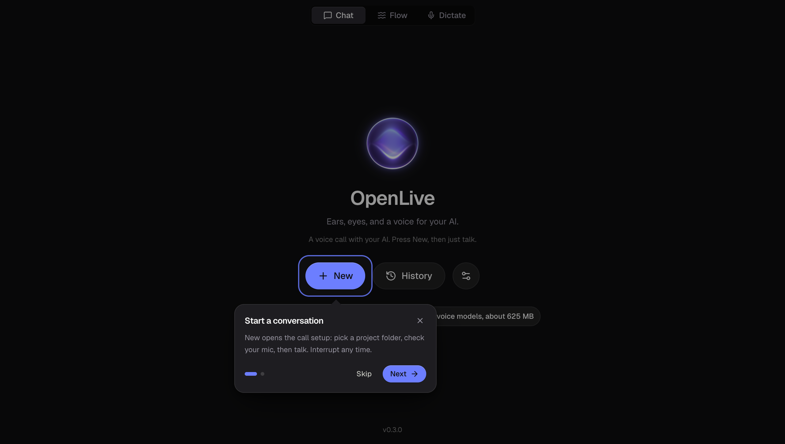 |

## Why on-device voice matters

The listening and speaking never leave your computer. The only thing that goes out
is the text turn to whoever answers, the same call you would make from any app.
No audio uploads, no per-minute meter, no lock-in.

That also skips the separate speech-to-text, text-to-speech, and real-time-audio
fees hosted platforms charge on top. You still pay your normal model and vision API
costs, nothing more. With a coding agent answering there's nothing extra to pay
at all; it runs under the login you already have.

## Privacy

Your voice stays on your machine. The transcript, and camera or screen frames if you
turn them on, go only to whoever answers.

Separately, the desktop app shares anonymous usage counts: which features get used,
errors and speed. Never what you say or type, your files, names, window titles,
keys, model ids or error text.

```
 on by default ──▶ notice on first run ──▶ nothing sent before you have seen it
                                       └──▶ off any time: Settings > Privacy,
                                            or OPENLIVE_TELEMETRY=0 / DO_NOT_TRACK=1
```

- Builds you run from source, and any build without release settings, send nothing.
- Turning it off in the app sends one last anonymous event saying so, then nothing.
- The install ID is random, not tied to you, your hardware or an account.
  So is the readable name made from it, like `swift-otter-1a2b3c4d`: nobody types it, and
  turning sharing off and on gives a new one.
- Every event and every field is listed in [docs/TELEMETRY.md](docs/TELEMETRY.md), and
  [docs/PRIVACY.md](docs/PRIVACY.md) is the privacy policy: what is collected and why, where
  it is stored, and your choices.
- Now and then a small card asks how a session went, or how likely you are to recommend
  OpenLive. It is rare, takes one tap, has no text box, never appears mid-session and has a
  "Don't ask again".
- Settings > Privacy has **Request deletion**: it opens a draft email with your anonymous
  name, and nothing is sent until you send it. Usage data is kept 24 months, then deleted.
- Logs and crash details are never uploaded. **Report a problem** in Settings > Privacy
  opens a GitHub issue you write yourself.

Everything OpenLive keeps on your computer is in one folder, like `~/.claude`:
`~/.openlive` on macOS and Linux, `%USERPROFILE%\.openlive` on Windows. Settings >
About > Your data > **Open folder** opens it. Set `OPENLIVE_HOME` to put it elsewhere. **Reset local data** on the same page
erases it and starts fresh, after a confirm.

```
~/.openlive/
  settings.json   your preferences, plain text
  mcp.json        your connectors, the same {"mcpServers": ...} shape other tools use
  memory.json     what OpenLive remembered for you
  skills/         your skills
  secrets/        API keys and tokens, encrypted, readable by your user only
  data/           chats, voice profiles, downloaded voice models
  flow/           Flow's settings and history, and Dictate's dictations
  workspace/      Flow's own folder for files it makes
  state/          window position, app state, usage-sharing state
  logs/           agent.log
  cache/          scratch files
```

The first start of a version with this folder moves what earlier versions kept in
the app's data folder into it, once, and leaves a `MIGRATED.txt` behind saying where
it went.

## How it works

```
mic ─▶ VAD ─▶ streaming STT ─▶ end-of-turn ─▶ your AI ──────────▶ streaming TTS ─▶ speaker
     (Silero)  (Whisper or      (Smart-Turn)  (BYO model, or a     (Kokoro / Supertonic /
               native engines)      ▲          coding agent over    Pocket / Kitten /
                camera / screen ────┘          ACP on local stdio)  your cloned voice)
                frames (vision)
```

Everything outside "your AI" runs locally: in the renderer, or for native engines in
the local agent service. The turn goes over a warm
local WebSocket to a small agent server, which either streams a provider reply or
drives your coding agent's ACP adapter as a child process. The app starts speaking
sentence by sentence while the reply is still being written.

Flow runs the same voice loop in a hidden window, with a second local socket and
a tool loop on the agent server:

```
Control, Control ─▶ orb ─▶ voice loop ─▶ Flow socket ─▶ your AI ─▶ tools ─▶ your apps
                   (over                (flow-ws)     (API      (type, click,
                    the dock)                          or ACP)   screenshot, OCR…)
```

## Get started

**Just use it:** grab the installer from the
[latest release](https://github.com/katipally/openlive/releases/latest) and open the app.
Once installed, it opens at login; switch that off in Settings > General.
Welcome walks you through the three modes, who answers you, what the computer has to
allow and How you talk, then each mode shows a short tour the first time. Paste a model
key, or pick the coding agent you already use (install and sign in from Settings >
Agents if needed), and start a call. Missed something? Settings > About > **Show me
around again** plays it all again. The first Start asks before the voice models download from
Hugging Face, with their size (roughly 200 MB with Kokoro, more with
Supertonic, a bigger Whisper or WebGPU's full-precision weights), and they are
cached after that. A voice or language switched mid-call, a voice preview or a
clip to transcribe asks the same way, in place, before anything more downloads.

**Build it from source:**

```bash
pnpm install
pnpm desktop:dev      # runs the web + agent servers and opens the app window
```

You can also run it in a browser during development with `pnpm dev`, then open
`localhost:3000`. Run the tests with `pnpm test`.

## Repo layout

```
apps/desktop     Electron shell: spawns the local servers, media perms, window,
                 Flow's orb, tray + notifications
apps/web         Next.js UI + the on-device voice engine (src/lib/live/*) + /api routes
                 (agents install/auth, history discovery, settings)
services/agent   Hono + ws: the /live WebSocket, the ACP agent driver (acp-agent.ts,
                 supervisor.ts), voice cloning (voice/*), the built-in provider turn loop
packages/shared  the agent registry (single source of agent identity), wire protocol,
                 shared types
packages/harness provider-neutral model adapters, live model listing, cost/effort
packages/db      the store under ~/.openlive: encrypted keys, settings, chats, connectors
packages/flow-store Flow's config and session history in ~/.openlive/flow
native/ol-input  Rust addon for Flow: the global key, typing, capture, OCR, input
native/openlive-cu  Rust computer-use helper the agent drives over a local socket,
                 shipped as its own app so its OS grants are its own
tools/           evals behind the root scripts: voice:*, voiceprint:eval,
                 addressee:*, converse:eval
```

Flow's pieces: `apps/web/src/components/flow` and `src/lib/flow` (the orb and its
owner renderer), `services/agent/src/flow` and `src/live/flow-ws.ts` (the tool loop,
brains, and tools), and `apps/desktop/flow-*.cjs` (the addon bridge).

For how the pieces fit together (the ACP driver, the voice loop, resume, and the
delegate/worker tool flow), see [docs/ARCHITECTURE.md](docs/ARCHITECTURE.md).
For each mode, see [docs/CHAT.md](docs/CHAT.md), [docs/FLOW.md](docs/FLOW.md) and
[docs/DICTATE.md](docs/DICTATE.md).

## Contributing

OpenLive is open to contributions. Start with [CONTRIBUTING.md](CONTRIBUTING.md) for
how to set up, where things live, and how to send a change. Good first issues are
labeled in the tracker.

## License

[MIT](LICENSE). Use it, change it, ship it.
