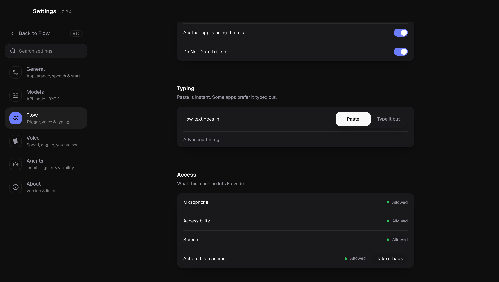

# Flow

Flow is OpenLive's voice assistant for the whole machine. Tap `Control` twice in
any app, say what you want, and Flow answers out loud, types into the app you are
in, or drives the Mac for you: opening apps and links, clicking, typing, scrolling,
reading the screen. It runs on the same on-device voice loop as a call, with the
brain you pick: a model you have a key for, or a coding agent you already use.


- [Summoning Flow](#summoning-flow)
- [The orb](#the-orb)
- [What Flow can do](#what-flow-can-do)
- [Safety: Stop, consent, and the permission card](#safety-stop-consent-and-the-permission-card)
- [Failure cards](#failure-cards)
- [Settings](#settings)
- [Privacy: what goes where](#privacy-what-goes-where)
- [Platform support](#platform-support)
- [Troubleshooting](#troubleshooting)
- [Architecture (for developers)](#architecture-for-developers)

## Summoning Flow

```
 any app ──▶ tap Control, Control ──▶ orb rises over the dock ──▶ talk
                                              │
             tap Control, Control again ◀─────┘  (or the orb's close button)
```

| Way in | What it does |
|---|---|
| Double tap `Control` (`Ctrl` on Windows and Linux) | Opens Flow. The same gesture closes it. |
| Tray / menu bar > **New Flow session** | Opens Flow, or starts a fresh session if Flow is already open. Enabled only when Flow is ready. |
| Tray / menu bar > **Flow armed** | Quick on/off switch for the key listener. Off closes Flow and ignores the gesture. |
| Tray / menu bar > **Flow settings...** | Opens Settings > Flow. |
| Flow tab in the OpenLive window | Home for Flow: readiness, the brain in use, and your session history. |

The trigger is fixed to the double `Control` tap; there is no setting to rebind it.
Flow only listens to the keyboard for that key, has no wake word, and opens the
microphone only while Flow is open. Once open, you just talk: Smart-Turn decides
where each sentence ends, and Flow waits for the next one. It closes on the gesture,
on the orb's close button, or after the **Stay open after the last reply** time
with nothing said.

Flow belongs to the machine, not to the OpenLive window. Closing the window (or
`Cmd+Q`, which closes to the menu bar) keeps Flow running; only the tray's **Quit**
ends it. A login launch can start as just the tray with Flow ready.

## The orb

Flow shows one thing on screen: the Wave Orb, in a small always-on-top window
above the dock. It is click-through, so it never blocks the app underneath, except
for the orb itself and anything it is showing. What was said lives in the session
transcript, not on the orb.


| State | Looks like | Means |
|---|---|---|
| Listening | Calm teal, swells with your voice | The mic is open, waiting for you to finish a sentence. |
| Thinking | Violet | The brain is working on the turn. |
| Acting | Magenta, with the caption strip | A tool is running on your machine. |
| Speaking | Blue, moving with the voice | Flow is saying the reply. |
| Error | Dark red, with a failure card | The turn failed; the card says why. |

**Hover controls.** Point at the orb and two buttons appear beside it: close
Flow on the left, open OpenLive on the right.


**Caption strip.** While Flow acts on the machine, a strip above the orb names the
action ("Opening an app", "Looking at the screen", "Clicking", "Running a command")
with a **Stop** button. It is drawn the whole time Flow is acting, so you never have
to go looking for what it is doing. While it acts, a halo also follows the real
pointer; the halo is hidden from screen capture so Flow never photographs it.


## What Flow can do

Each turn, the model picks one of three things: put words where your cursor is,
answer you out loud, or do something on the machine.

| Group | Tools |
|---|---|
| Words | `insert_text` (types at your cursor, streamed as it is written), `read_selection`, `clipboard_read`, `clipboard_write`, `get_context` (front app, window title, selection) |
| Seeing | `screenshot` (a display or one window), `read_screen_text` (OCR with positions), `wait` (let the screen catch up, then look again), `list_windows`, `get_window`, `camera_frame` (one frame, camera on only for that frame) |
| Pointer and keys | `click`, `double_click`, `right_click`, `move`, `drag`, `scroll`, `mouse_down`, `mouse_up`, `type`, `keypress` |
| Windows and apps | `window_activate`, `window_move`, `window_resize`, `window_minimize`, `window_close`, `open_app`, `open_url` |
| Commands | `shell` (runs in your home folder through your login shell, 30 second limit) |

Every action hands back a fresh screenshot, so the model checks that the step
worked before the next one. Only the newest three screenshots stay in the model's
context.

**Brains.** Settings > Flow > Brain:

- **API mode (BYOK).** The provider, model, effort, vision model and Ollama
  address you set in Settings > Models, shared with Chat. Any provider OpenLive
  supports, including MiniMax, OpenAI, Anthropic, Google, Groq and Ollama.
- **A coding agent** (Claude Code, Codex, Cursor, OpenCode, Hermes, whichever are
  installed), driven over ACP. You can pin its model and effort, or leave the
  agent's defaults.

**Vision.** Screenshots reach models that can see on every provider. A model that
cannot see gets a description from the vision model set in Settings > Models when
one is set, and otherwise a plain note that a picture was not sent, so it never
claims to see it.

## Safety: Stop, consent, and the permission card

```
 first action ever ──▶ "is it alright for me to act on this machine?" ──▶ Yes ──▶ remembered
                                     │                                   Cancel / silence (20 s)
                                     ▼                                        ▼
                             answer by voice or tap                  this action is blocked,
                                                                     asked again next time
```

- **Consent, once.** Flow asks one question before it first acts on the machine,
  on the orb, spoken and with buttons. Say "yes" or "cancel", or tap. A yes is
  remembered; Settings > Flow > Access > **Act on this machine** shows it and
  **Take it back** withdraws it. No answer in 20 seconds counts as no.
- **After that, no per-action questions.** Flow does not stop to confirm each
  click. The caption strip and **Stop** are the control: Stop ends what Flow is
  doing and keeps the mic open; closing Flow also drops the turn and closes the
  mic.
- **Talk over it.** With **Let me talk over it** on, speaking cuts the reply off
  mid-word and only what was said is kept.
- **Coding agents.** With consent given, Flow switches the agent into its
  no-questions mode when it has one, and answers the agent's own permission asks
  with its broadest yes. Without consent, the agent's question shows on the orb.


## Failure cards

Nothing fails silently. A card rises out of the orb with the cause and, where there
is one, a single button that fixes it.


| Card | Cause | Fix |
|---|---|---|
| Flow's key listener stopped | The global key hook died | **Try again** restarts it |
| I can hear you, but I cannot type for you | No Accessibility (macOS) or input access | **Open settings**, then allow OpenLive |
| Wayland will not hand out a global key | Wayland session | Use the tray's New Flow session, or an X11 session |
| A password field has the keyboard | Secure input is on | Leave the password field |
| No brain is configured yet | No key for the chosen provider, and no agent | **Choose one** opens Settings > Flow |
| You are offline | No network | **Try again** |
| The voice models are not downloaded yet | First run | **Download** |
| I could not open the microphone | Another app holds it | **Try again** |
| API mode has no key yet / The key or sign-in was refused | Missing or refused key or sign-in | **Open settings** (Models, or Agents for a coding agent) |
| That model is not available | Unknown model | **Open settings** |
| I could not reach the model | Provider or Ollama unreachable | **Open settings** when the address is the problem |
| Out of credit / The provider is busy right now | Billing or rate limit | Wait, or top up |
| That answer never came back | Nothing arrived for 90 seconds | Say it again |
| The connection dropped mid-answer | The local link went down mid-reply | Say it again |

Every card also has **Close Flow**.

## Settings

Settings > Flow ("Trigger, voice & typing"):

| Section | Setting | Options |
|---|---|---|
| Brain | Who does the thinking | API mode, or an installed coding agent (model and effort) |
| Voice | Say replies out loud | On / off |
| | Let me talk over it | On / off (barge-in) |
| | Wait before answering | Patient, Even, Quick |
| | Stay open after the last reply | 90 sec, 5 min, 30 min |
| Go quiet when | A meeting app is in front / Another app is using the mic / Do Not Disturb is on | Replies switch to text for that turn |
| Typing | How text goes in | Paste (instant) or Type it out, plus advanced timing |
| Access | Microphone, Accessibility, Screen, Act on this machine | Status and the button to grant or withdraw |

API mode's provider, model, vision model and Ollama address live in Settings >
Models and are shared with Chat.




## Privacy: what goes where

| Data | Where it goes |
|---|---|
| Your voice | Nowhere. Speech to text, turn detection and text to speech run on-device. No audio is kept. |
| What you said (transcribed text) | The brain you picked. |
| Turn context: front app, window title, selected text | The brain, with each turn. |
| Screenshots, OCR text, clipboard, command output | The brain, when a tool that reads them runs. For a model that cannot see, pictures go to the vision model you set instead. |
| Camera | Only when `camera_frame` runs, one frame, then the camera closes. |
| Session history | On this machine, in `~/.openlive/flow/` (transcripts in `sessions/`, up to 60 screenshots per session in `assets/`), folders created private to your user. |

A coding agent brain uses its own provider under your own login. Its tools come
from a local MCP server (`openlive-flow`) bound to `127.0.0.1`.

**Remote Ollama.** An Ollama address on this computer saves at once. Any other
address asks first in a native dialog in the desktop app, because that server
will receive what you say and type, and screen content including screenshots. It
cannot be set from a plain browser.

## Platform support

Flow runs in the desktop app only. Its hotkey, text insertion, capture, OCR and
input live in a Rust addon (`native/ol-input`) with macOS, Windows and Linux
backends. The Access section and the capability panel report what the running
machine can actually do, and Flow says when it cannot rather than guessing.

| | macOS | Windows | Linux (X11) | Linux (Wayland) |
|---|---|---|---|---|
| Double tap trigger | Needs Accessibility | Yes | Yes | No (compositor blocks it); use the tray |
| Typing and clicking | Needs Accessibility | Yes, except into windows running as administrator | Needs one of `xdotool`, `ydotool`, `wtype`, `kwtype`, `dotool` | Same |
| Screen capture | Needs Screen Recording | Yes (GDI) | Needs `grim`, `spectacle`, `gnome-screenshot`, `maim` or `import` | Same |
| OCR | Vision | Windows OCR | Needs `tesseract` | Same |
| Selection | Accessibility | UI Automation | `xclip` or `xsel` | `wl-paste` |

**macOS permissions.** Microphone, Accessibility (the key listener, typing,
clicking, reading the selection) and Screen Recording (screenshots). After
granting Screen Recording, quit and reopen OpenLive: macOS gives the right to the
app, not to the copy already running.

## Troubleshooting

- **The double tap does nothing.** Check the Flow tab: the chip should say
  **Ready**. **Off** means Accessibility is missing or **Flow armed** is off in
  the tray; **Key listener stopped** means the hook died (the failure card's
  **Try again** restarts it). In a password field secure input hides every key.
- **Flow hears me but never types.** Grant Accessibility, then press **Open
  settings** on the card. Windows running as administrator refuse input from a
  non-elevated app.
- **"Granted, but this copy of OpenLive cannot capture".** Quit OpenLive from the
  tray and open it again.
- **Replies come back as text, not voice.** A go-quiet rule fired (meeting app,
  mic in use, Do Not Disturb), output is muted, or **Say replies out loud** is off.
- **"I could not reach the model".** For Ollama, check it is running and the
  address in Settings > Models.
- **Typed text lands wrong in some apps.** Switch **How text goes in** to
  **Type it out**, or tune the advanced timing.

## Architecture (for developers)

Flow runs with no visible window, so the work is split across the Electron main
process, two hidden or floating renderers, and the agent service.

```
 main process (apps/desktop)                     renderers (apps/web)
 ┌──────────────────────────────┐               ┌──────────────────────────────────┐
 │ flow-input.cjs  ol-input hook ├── effect ───▶ │ owner window  /flow-owner (hidden)│
 │ tray, summon/dismiss, bounds  │               │  useFlowOwner: mic, VAD, Whisper, │
 │ flow-runtime.cjs              │◀── device ─── │  Smart-Turn, TTS, every decision  │
 │  context, quiet signals,      │    calls      │           │ panel-state IPC       │
 │  capture / OCR / control,     │               │           ▼                       │
 │  shell, cursor halo           │               │ orb window  /flow (always on top) │
 └──────────────────────────────┘               │  FlowOrb: orb, caption + Stop,    │
                                                 │  cards; commands back over IPC    │
                                                 └───────────┬──────────────────────┘
                                                             │ /live WebSocket (flow)
                                                             ▼
                                      agent service (services/agent)
                                      live/flow-ws.ts  FlowSession
                                        ├─ flow/loop.ts    runFlow: turns and tool calls
                                        ├─ flow/brain.ts   LocalBrain (provider) | AcpBrain
                                        ├─ flow/tools.ts + device-tools.ts
                                        ├─ flow/approval.ts consent, once
                                        └─ flow/mcp.ts     same tools as MCP for ACP agents
```

- **Owner window** (`apps/web/src/lib/flow/useFlowOwner.ts`). Hidden, with
  background throttling off. It holds the microphone, the voice cascade and the
  Flow socket, derives failures (`lib/flow/failure.ts`) and auto-quiet
  (`lib/flow/quiet.ts`), and publishes a small snapshot to the orb.
- **Orb window** (`apps/web/src/components/flow/FlowOrb.tsx`). Display and command
  surface only. The main process forwards pointer moves, and the orb hit-tests its
  own `data-hit` elements so the air around it stays click-through. The same
  window carries a live call's controls while the main window is hidden.
- **Main process** (`apps/desktop/main.cjs`, `flow-input.cjs`,
  `flow-runtime.cjs`, `flow-cursor.cjs`). Loads the addon, owns the tray and the
  window bounds, and answers every perception and control call as one named IPC
  round trip.
- **flow-ws** (`services/agent/src/live/flow-ws.ts`). Flow's side of `/live`: a
  separate connection with the same schemas and permission protocol as Chat. One
  rolling session, persisted through `packages/flow-store`.
- **Loop and brains** (`services/agent/src/flow/`). `runFlow` runs turns until the
  model stops calling tools, Stop or barge-in aborts, or an error ends it; there
  is no step budget. `LocalBrain` streams from `packages/harness` providers;
  `AcpBrain` wraps a supervised ACP agent, which reaches the same `Tool[]` through
  the local MCP server, so both brains see identical tools.
- **Harness adapters** (`packages/harness`). Anthropic `/messages`, OpenAI
  `/responses` and `/chat/completions` cover every provider, including tool
  screenshots and signed thinking between tool calls.
