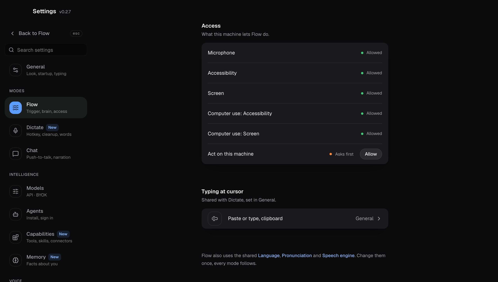

# Flow

Ask your computer, from any app. Tap `Control` twice (`Ctrl` on Windows and
Linux), say what you want, and your AI listens, answers out loud, and can act
for you: open apps and links, click, type, scroll, read the screen, run
commands. It works on macOS, Windows and Linux, on the same on-device voice loop
as a call, and thinks with your API key or a coding agent you already use.

Flow is not [Dictate](DICTATE.md). Dictate is voice typing: it types what you
say into the text box in front of you, with no AI and nothing spoken back.


- [Summoning Flow](#summoning-flow)
- [The orb](#the-orb)
- [What Flow can do](#what-flow-can-do)
- [Safety: Stop, consent, and the permission card](#safety-stop-consent-and-the-permission-card)
- [Failure cards](#failure-cards)
- [Settings](#settings)
- [Privacy: what goes where](#privacy-what-goes-where)
- [Platform support](#platform-support)
- [Troubleshooting](#troubleshooting)
- [Architecture (for developers)](#architecture-for-developers)

## Summoning Flow

```
 any app ──▶ tap Control, Control ──▶ orb rises over the dock ──▶ talk
                                              │
             tap Control, Control again ◀─────┘  (or the orb's close button)
```

| Way in | What it does |
|---|---|
| Double tap `Control` (`Ctrl` on Windows and Linux), either side | Opens Flow. The same gesture closes it. The key is yours to change. |
| Tray / menu bar > **Start Flow** | Opens Flow, or starts a fresh session if Flow is already open. Enabled only when Flow is ready. |
| **Flow is on** on Flow's home | On/off switch for the key listener. Off closes Flow and ignores the gesture until you turn it back on, here or from the tray, and stays off when OpenLive restarts. Settings > Flow says which it is and links here. |
| Flow tab in the OpenLive window | Home for Flow: the switch, readiness, who answers, and your session history. |

The tray (menu bar) menu is short:

```
 Flow is ready  ·  Double-tap ⌃       status, in plain words
 Dictate is on  ·  Double-tap ⌥        Dictate's, the same way
 ─────────────────────────────
 Open OpenLive
 Start Flow
 Turn Flow off                        the switch on Flow's home
 Turn Dictate off                     the switch on Dictate's home
 How you talk  ▸  ◉ Hands-free        the same choice as Settings > General
                  ○ Push to talk  ·  Hold Fn
 Settings…                    ⌘,
 ─────────────────────────────
 Quit OpenLive
```

The status line reads **Flow is ready** (with the gesture, `Double-tap Ctrl`
on Windows and Linux), **Flow is open**, **Flow needs permission** (with
**Allow Accessibility…** under it, **Allow input access…** off macOS),
**Flow stopped listening** (the key listener died) or **Flow is off** (the
switch on Flow's home is off). Dictate's line works the same way; see
[Dictate](DICTATE.md#dictates-home).

Flow only listens to the keyboard for its keys, has no wake word, and opens
the microphone only while Flow is open. How you talk once it is open is one
setting for Flow, Dictate and calls, in Settings > General > **How you talk**
(also in the tray):

```
 open ──▶ Hands-free:   just talk; Smart-Turn decides where each sentence ends
      └─▶ Push to talk: hold Fn (Right Ctrl on Windows and Linux) while you talk;
                        letting go ends what you said. The microphone is on
                        only while the key is down.
```

It closes on the gesture, on the orb's close button, or after **Close after
silence** (30 sec by default; 90 sec, 5 min or Never) with nothing said and
nothing being answered; in push to talk, a stretch with no hold counts as
silence. Esc never closes it: Esc always goes to the app in front. It also
closes when the computer sleeps, and by default when the screen locks (macOS
and Windows); see [Settings](#settings). Opening Flow closes
[Dictate](DICTATE.md), and opening Dictate closes Flow.

Every key is editable in Settings > General: **Open Flow** (double-tap
Control), **Open Dictate** (double-tap Option or Alt) and **Push to talk**,
each with a picker, a clash check and **Reset**, and a change applies at once.
The rules (one side kept for push to talk, Fn and the 🌐 setting on macOS,
AltGr on Windows and Linux) are in [Dictate's Keys](DICTATE.md#keys).

Flow belongs to the machine, not to the OpenLive window. Closing the window (or
`Cmd+Q`, which closes to the menu bar) keeps Flow running; only the tray's **Quit
OpenLive** ends it. A login launch can start as just the tray with Flow ready.

## The orb

Flow shows one thing on screen: the Wave Orb, in a small always-on-top window
above the dock. It is click-through, so it never blocks the app underneath, except
for the orb itself and anything it is showing. On Wayland no app can see the
pointer outside its own windows, so there the whole orb window takes clicks while
it is up. Clicking the orb never takes focus from the app you are typing into. What was said lives in the session
transcript, not on the orb.


| State | Looks like | Means |
|---|---|---|
| Listening | Calm teal, swells with your voice | The mic is open, waiting for you to finish a sentence. |
| Thinking | Violet | The brain is working on the turn. |
| Acting | Magenta, with the caption strip | A tool is running on your machine. |
| Speaking | Blue, moving with the voice | Flow is saying the reply. |
| Error | Dark red, with a failure card | The turn failed; the card says why. |

**Hover controls.** Point at the orb and three buttons appear around it: close
Flow on the left, open OpenLive on the right, and above it the mic, which opens
[Dictate](DICTATE.md). While Dictate is open, the mic becomes a badge, always
shown, that says how it listens and closes it. In push to talk, a badge over
the orb says which key to hold while Flow waits for it.


**Caption strip.** While Flow acts on the machine, a strip above the orb names the
action ("Opening an app", "Looking at the screen", "Clicking", "Running a command")
with a **Stop** button. It is one line: a long caption drops its oldest words, so
the newest stay in view. It is drawn the whole time Flow is acting, so you never have
to go looking for what it is doing. While it acts, a halo also follows the real
pointer; the halo is hidden from screen capture so Flow never photographs it.

**Replies in text.** With **Say replies out loud** off, or a turn gone quiet
(a meeting app in front, the mic busy, Do Not Disturb), the reply is written in
the caption strip as it comes instead of said. It wraps, scrolls once it
outgrows a few lines, and stays until you say the next thing.


## What Flow can do

Each turn, the model picks one of three things: put words where your cursor is,
answer you out loud, or do something on the machine.

| Group | Tools |
|---|---|
| Words | `insert_text` (types at your cursor, streamed as it is written), `read_selection`, `clipboard_read`, `clipboard_write`, `get_context` (front app, window title, selection) |
| Seeing | `screenshot` (a display or one window), `read_screen_text` (OCR with positions), `wait` (let the screen catch up, then look again), `list_windows`, `get_window`, `camera_frame` (one frame, camera on only for that frame) |
| Pointer and keys | `click`, `double_click`, `right_click`, `move`, `drag`, `scroll`, `mouse_down`, `mouse_up`, `type`, `keypress` |
| Windows and apps | `window_activate`, `window_move`, `window_resize`, `window_minimize`, `window_close`, `open_app`, `open_url` |
| Commands | `shell` (runs in your home folder through your login shell, 30 second limit) |
| OpenLive's own | `delegate` (web research by a helper that searches and reads pages), `remember` (memory shared with calls and every brain) |
| Files | `list_dir`, `read_file`, `write_file`, `edit_file` anywhere in your home folder, a relative path starting in Flow's own folder (`workspace/` in the OpenLive home); `find_files`, `list_edits`, `undo_edit`: every write and edit is kept, so it can be undone |
| Reminders | `set_timer`, `remind` (at a local time or in a while, optionally daily, weekdays or weekly), `list_reminders`, `cancel_reminder`: they go off with a notification and a spoken line even after Flow closes, and work offline |

Every action hands back a fresh screenshot, so the model checks that the step
worked before the next one. Only the newest three screenshots stay in the model's
context. With the computer-use helper (below), only the newest window state, its
element tree and picture, goes to the model at all: it rides after the
conversation on each request and is never stored in it, so earlier messages stay
byte-identical and the provider's prompt cache keeps serving them. A coding agent
keeps its own history and gets every state as an ordinary tool result.

These are the same tools a call has: Chat and Flow draw on one tool registry,
and a call in the desktop app can reach the machine too. Flow takes its one
permission up front; a call asks before each action that changes something.

**Who answers.** Flow follows the default, set once in Settings > Models >
**Who answers you** (and in Welcome), which new chats and Dictate's AI polish
start with too. Settings > Flow > **Who answers in Flow** can give Flow its own
instead (**Same as default** or **Its own**):

- **Your API key.** The provider, model, effort, vision model and Ollama
  address you set in Settings > Models. Any provider OpenLive supports,
  including MiniMax, OpenAI, Anthropic, Google, Groq and Ollama.
- **A coding agent** (Claude Code, Codex, Cursor, OpenCode, Hermes, Gemini CLI, GitHub Copilot, Kiro, Pi, whichever are
  installed), driven over ACP. You can pin its model and effort, or leave the
  agent's defaults. It starts in Flow's own folder, `workspace/` in the
  OpenLive home, made on first use.

**Vision.** Screenshots reach models that can see on every provider. A model that
cannot see gets a description from the vision model set in Settings > Models when
one is set, and otherwise a plain note that a picture was not sent, so it never
claims to see it.

## Safety: Stop, consent, and the permission card

```
 first action ever ──▶ "is it alright for me to act on this machine?" ──▶ Yes ──▶ remembered
                                     │                                   Cancel / silence (20 s)
                                     ▼                                        ▼
                             answer by voice or tap                  this action is blocked,
                                                                     asked again next time
```

- **Consent, once.** Flow asks one question before it first acts on the machine,
  on the orb, spoken and with buttons. Say "yes" or "cancel", or tap. A yes is
  remembered; Settings > Flow > Access > **Act on this machine** shows it and
  **Take it back** withdraws it. No answer in 20 seconds counts as no.
- **After that, no per-action questions.** Flow does not stop to confirm each
  click. The caption strip and **Stop** are the control: Stop ends what Flow is
  doing, refuses any question it has up, and keeps the mic open; closing Flow
  also drops the turn and closes the mic.
- **Talk over it.** Speaking cuts the reply off mid-word and only what was said
  is kept.
- **Coding agents.** With consent given, Flow switches the agent into its
  no-questions mode when it has one, and answers the agent's own permission asks
  with its broadest yes. Without consent, the agent's question shows on the orb,
  and a spoken yes or no answers it. A sentence said before the question showed
  refuses it and is taken as said.


## Failure cards

Nothing fails silently. A card rises out of the orb with the cause and, where there
is one, a single button that fixes it.


| Card | Cause | Fix |
|---|---|---|
| Flow's key listener stopped | The global key hook died or could not start. On Linux (X11 or Wayland) that usually means no read access to `/dev/input` | **Try again** restarts it. On Linux, first add yourself to the `input` group (`sudo usermod -aG input $USER`) and sign back in |
| I can hear you, but I cannot type for you | No Accessibility (macOS) or input access | **Open settings**, then allow OpenLive |
| A password field has the keyboard | Secure input is on | Leave the password field |
| Nothing is set to answer yet | No key for the chosen provider, and no agent | **Choose one** opens Settings > Flow |
| You are offline | No network | **Try again** |
| The voice models are not downloaded yet | First run | **Download** |
| I could not open the microphone | Another app holds it | **Try again** |
| Your API key is missing / The key or sign-in was refused | Missing or refused key or sign-in | **Open settings** (Models, or Agents for a coding agent) |
| That model is not available | Unknown model | **Open settings** |
| I could not reach the model | Provider or Ollama unreachable | **Open settings** when the address is the problem |
| Out of credit / The provider is busy right now | Billing or rate limit | Wait, or top up |
| That answer never came back | Nothing arrived for 90 seconds | Say it again |
| The connection dropped mid-answer | The local link went down mid-reply | Say it again |

Every card also has **Close Flow**.

## Settings

Settings > Flow ("Trigger, who answers") opens with one line saying whether
Flow is on, with a link to Flow's home, where the switch is.

| Section | Setting | Options |
|---|---|---|
| Trigger | Open and close | The double tap, shown as keycaps, with a note when the key listener stopped; set in General |
| | How you talk, Close after silence | Links to Settings > General, shared with Dictate and calls |
| Who answers | Who answers in Flow | Same as default, or Its own: your API key, or an installed coding agent (model and effort under Advanced) |
| Voice | Say replies out loud | On / off |
| | Wait before answering | Patient, Even, Quick |
| Go quiet when | A meeting app is in front / Another app is using the mic / Do Not Disturb is on | Replies switch to text for that turn |
| Access | Microphone, Accessibility, Screen, Computer use (macOS, Linux), Act on this machine | Status as a dot and a word, the button to grant or withdraw, and the system settings page under ⋯ |
| Typing at cursor | Paste or type, clipboard | Goes to Settings > General > Typing at cursor, shared with Dictate |

Your API key's provider, model, vision model and Ollama address, and the
default for who answers, live in Settings > Models and are shared with Chat.




**Screen lock.** By default, locking the screen closes Flow and ends a call, the
way sleep does. Flow is armed again on unlock, and a call picks back up with
Start. Settings > General > **End Flow and calls when the screen locks** turns
that off, for a long call or a running task that should survive a lock. Sleep
always does. With it off, Flow keeps listening while the screen is locked and can
still act on the computer, so anyone in earshot can talk to it. It is the same
for your API key and coding agents, and it exists on
macOS and Windows only, the systems that report a lock.

## Privacy: what goes where

| Data | Where it goes |
|---|---|
| Your voice | Nowhere. Speech to text, turn detection and text to speech run on-device. No audio is kept. |
| What you said (transcribed text) | The brain you picked. |
| Turn context: front app, window title, selected text | The brain, with each turn. |
| Screenshots, OCR text, clipboard, command output | The brain, when a tool that reads them runs. For a model that cannot see, pictures go to the vision model you set instead. |
| Camera | Only when `camera_frame` runs, one frame, then the camera closes. |
| Session history | On this machine, in `~/.openlive/flow/` (transcripts in `sessions/`, up to 60 screenshots per session in `assets/`), folders created private to your user. A dev checkout keeps its own in `<repo>/data/flow/`. |
| Usage counts (session length, turns and tool calls by kind, failure card codes, timings) | OpenLive's analytics server, as numbers and fixed labels. Never words, window titles, file names, screen content or model ids. On by default, off in Settings > Privacy. Every event is listed in [TELEMETRY.md](TELEMETRY.md). |

A coding agent brain uses its own provider under your own login. Its tools come
from a local MCP server (`openlive`) bound to `127.0.0.1`.

**Remote Ollama.** An Ollama address on this computer saves at once. Any other
address asks first in a native dialog in the desktop app, because that server
will receive what you say and type, and screen content including screenshots. It
cannot be set from a plain browser.

## Platform support

Flow runs in the desktop app only. Its hotkey, text insertion, capture, OCR and
input live in a Rust addon (`native/ol-input`) with macOS, Windows and Linux
backends. The Access section and the capability panel report what the running
machine can actually do, and Flow says when it cannot rather than guessing.

| | macOS | Windows | Linux (X11) | Linux (Wayland) |
|---|---|---|---|---|
| Double tap trigger and push to talk key | Needs Accessibility | Yes | Needs the `input` group | Needs the `input` group |
| Typing and clicking | Needs Accessibility | Yes, except into windows running as administrator | Needs one of `xdotool`, `ydotool`, `wtype`, `kwtype`, `dotool` | Same |
| Screen capture | Needs Screen Recording | Yes (GDI) | Needs `grim`, `spectacle`, `gnome-screenshot`, `maim` or `import` | Same |
| OCR | Vision | Windows OCR | Needs `tesseract` | Same |
| Selection | Accessibility | UI Automation | `xclip` or `xsel` | `wl-paste` |
| Do Not Disturb (go quiet) | Yes | No (Windows does not report Focus) | GNOME only | GNOME only |

**macOS permissions.** Microphone, Accessibility (the key listener, typing,
clicking, reading the selection) and Screen Recording (screenshots). After
granting Screen Recording, quit and reopen OpenLive: macOS gives the right to the
app, not to the copy already running.

**Computer use on macOS.** Reading and operating app windows goes through a
separate helper app, **OpenLive Computer Use**, that ships inside OpenLive. It
works from each window's accessibility tree: Flow sees the window's controls,
numbered, and a picture of it, presses a button by its number rather than by
aiming at pixels, fills a field by setting its value, and reads every change
back where it can. It holds its own Accessibility and Screen Recording, listed
under Access as **Computer use: Accessibility** and **Computer use: Screen**;
**Allow** shows the system prompt and opens the right page in System Settings.
Password managers are off limits to it. On Windows the helper needs no grant.
Without the helper (a build that lacks it), Flow uses the screenshot, click and
typing tools in the table above.

**Computer use on Linux.** The same helper reads windows through the desktop's
accessibility bus (AT-SPI), on X11 and on Wayland. Access lists the same two
rows, each with a line on what it needs:

- **Computer use: Accessibility.** **Allow** switches the desktop's
  accessibility support on. Apps that were already open need a restart to
  show their controls. Chromium-based browsers and Electron apps (Slack,
  Discord, VS Code) show theirs only when started with
  `--force-renderer-accessibility`, or with `ACCESSIBILITY_ENABLED=1` in their
  environment; Flow says so when it meets one. On Cinnamon, turn accessibility
  on in System Settings instead.
- **Computer use: Screen.** On X11 there is nothing to allow. On Wayland,
  **Allow** shows the system's screen sharing dialog once: share every screen
  and allow remote control. The approval is kept (a restore token, in
  the OpenLive folder's `state/portal-token`) until you revoke it in the system's
  privacy settings or press Stop on the screen-sharing indicator, which also
  makes OpenLive forget it. While Flow is using the screen, GNOME and KDE show
  their screen-sharing indicator; it goes away two minutes after the last use.

On Wayland an app cannot know where its window is, so for most apps the
picture is the whole screen rather than one window, and Flow presses controls
through the apps' own actions. On sway, Hyprland and other wlroots desktops
the portal shares the screen but not the keyboard and pointer, so Flow can
read and press controls but not post clicks or keys. Pictures on Wayland need
PipeWire (installed by default on current GNOME and KDE), and pasting needs
`wl-clipboard`; without it Flow types the text.

## Troubleshooting

- **Holding the push to talk key does nothing.** It works only with Flow or
  Dictate open (or in a call), and only with **How you talk** set to **Push to
  talk**. On macOS, Fn held may also switch the input source or open Emoji &
  Symbols: set **Press 🌐 key to** to Do Nothing in Keyboard settings.
- **The double tap does nothing.** Check the Flow tab: it should say **Flow is
  on**, with a **Ready** chip. **Flow is off** means its switch there is off;
  **Allow Accessibility** (**Allow input access** off macOS) means the grant is
  missing; **Key listener stopped** means the hook died (the failure card's
  **Try again** restarts it). In a password field secure input hides every key.
- **Flow hears me but never types.** Grant Accessibility, then press **Open
  settings** on the card. Windows running as administrator refuse input from a
  non-elevated app.
- **"Granted, but this copy of OpenLive cannot capture".** Quit OpenLive from the
  tray and open it again.
- **Flow says Accessibility or Screen Recording is not allowed for OpenLive
  Computer Use (macOS).** Allow both **Computer use** rows under Access. They are
  separate from OpenLive's own grants.
- **Flow sees an app's window but none of its controls (Linux).** Restart the
  app after allowing **Computer use: Accessibility**. For a Chromium or
  Electron app, start it with `--force-renderer-accessibility`.
- **Flow says screen sharing is not set up (Linux, Wayland).** Allow
  **Computer use: Screen** under Access and answer the system's dialog.
- **Replies come back as text, not voice.** A go-quiet rule fired (meeting app,
  mic in use, Do Not Disturb), output is muted, or **Say replies out loud** is off.
- **"I could not reach the model".** For Ollama, check it is running and the
  address in Settings > Models.
- **Typed text lands wrong in some apps.** In Settings > General > Typing at
  cursor, switch **How text goes in** to **Type it out**, or tune the Advanced
  timing.

## Architecture (for developers)

Flow runs with no visible window, so the work is split across the Electron main
process, two hidden or floating renderers, and the agent service.

```
 main process (apps/desktop)                     renderers (apps/web)
 ┌──────────────────────────────┐               ┌──────────────────────────────────┐
 │ flow-input.cjs  ol-input hook ├── effect ───▶ │ owner window  /flow-owner (hidden)│
 │ tray, summon/dismiss, bounds  │               │  useFlowOwner: mic, VAD, Whisper, │
 │ flow-runtime.cjs              │◀── device ─── │  Smart-Turn, TTS, every decision  │
 │  context, quiet signals,      │    calls      │           │ panel-state IPC       │
 │  capture / OCR / control,     │               │           ▼                       │
 │  shell, cursor halo           │               │ orb window  /flow (always on top) │
 └──────────────────────────────┘               │  FlowOrb: orb, caption + Stop,    │
                                                 │  cards; commands back over IPC    │
                                                 └───────────┬──────────────────────┘
                                                             │ /live WebSocket (flow)
                                                             ▼
                                      agent service (services/agent)
                                      live/flow-ws.ts  FlowSession
                                        ├─ flow/loop.ts    runFlow: turns and tool calls
                                        ├─ flow/brain.ts   LocalBrain (provider) | AcpBrain
                                        ├─ capabilities/   the tools both modes share
                                        │    registry.ts + profiles.ts  FLOW's order, prompt
                                        │    approval.ts  consent, once
                                        │    mcp.ts       same tools as MCP for ACP agents
                                        └─ computer/       the computer-use helper
                                             helper.ts ── socket ──▶ openlive-cu (an app of its own on macOS)
```

- **Owner window** (`apps/web/src/lib/flow/useFlowOwner.ts`). Hidden, with
  background throttling off. It holds the microphone, the voice cascade and the
  Flow socket, derives failures (`lib/flow/failure.ts`) and auto-quiet
  (`lib/flow/quiet.ts`), and publishes a small snapshot to the orb.
- **Orb window** (`apps/web/src/components/flow/FlowOrb.tsx`). Display and command
  surface only. The main process forwards pointer moves (on X11 it polls the
  cursor while the orb is shown, `apps/desktop/orb-pointer.cjs`), and the orb
  hit-tests its own `data-hit` elements so the air around it stays click-through. The same
  window carries a live call's controls while the main window is hidden.
- **Main process** (`apps/desktop/main.cjs`, `flow-input.cjs`,
  `flow-runtime.cjs`, `flow-cursor.cjs`). Loads the addon, owns the tray and the
  window bounds, and answers every perception and control call as one named IPC
  round trip.
- **Computer-use helper** (`native/openlive-cu`, `services/agent/src/computer/`).
  A separate process the agent service starts on first use and shares across
  sessions, on macOS, Windows and Linux. Where it runs, its tree-first tools replace
  ol-input's screenshot, pointer and keyboard tools; ol-input keeps text
  insertion, the selection, window tools, opening apps and URLs, the shell and
  OCR. With no app named it looks at the frontmost window that is not
  OpenLive's own. On Windows it cannot drive an app running as administrator
  (UIPI; it says so), refuses keystrokes when Windows keeps the app in the
  background, and may flash WGC's yellow capture border for the frame a
  picture takes on Windows 10. On Linux it reads AT-SPI on X11 and Wayland;
  on Wayland its pictures and input go through one portal session the user
  approves once, and an app's picture is often the whole screen. Details in
  [ARCHITECTURE.md](ARCHITECTURE.md#computer-use-nativeopenlive-cu-servicesagentsrccomputer).
- **flow-ws** (`services/agent/src/live/flow-ws.ts`). Flow's side of `/live`: a
  separate connection with the same schemas and permission protocol as Chat. One
  rolling session, persisted through `packages/flow-store`.
- **Who answers** (`packages/flow-store/src/shared.ts`). `defaultBrain` reads
  the default from settings.json (`defaultAgent`, `defaultAgentModel`,
  `defaultAgentEffort`; unset is the API key), `flowBrain` gives Flow's own
  while `brain.override` is on and the default otherwise, and `dictateBrain`
  gives Dictate's own or Flow's. flow-ws, Dictate's rewrite, `/api/flow/config`
  and every screen resolve through them; a new chat records the default as its
  bind when it is made, so a later change of default never moves it.
- **Loop and brains** (`services/agent/src/flow/`). `runFlow` runs turns until the
  model stops calling tools, Stop or barge-in aborts, or an error ends it; there
  is no step budget. `LocalBrain` streams from `packages/harness` providers;
  `AcpBrain` wraps a supervised ACP agent, which reaches the same `ToolSet`
  through the local MCP server, so both brains see identical tools. Its calls there
  reach the orb and the session file as the built-in brain's do, and a cut
  reply is cut in its memory too (`Agent.cut`). Its own tools (Read, Bash,
  Edit) show on the orb by kind and file ("Reading src/app.ts") and are kept in
  the session file with their kind, file and short arguments, never the title
  (for a command that is the command line) or an argument named like a secret.
  `insert_text` types at once for a coding agent: MCP hands a tool its
  arguments whole, and Claude Code's ACP adapter streams a tool's input only
  field by field, so the text arrives in one piece.
- **Harness adapters** (`packages/harness`). Anthropic `/messages`, OpenAI
  `/responses` and `/chat/completions` cover every provider, including tool
  screenshots and signed thinking between tool calls.
